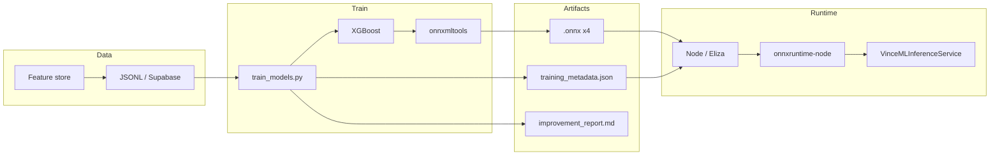

<div align="center">

# ONNX in VINCE

```
   ██████╗ ███╗   ██╗███╗   ██╗██╗  ██╗
  ██╔═══██╗████╗  ██║████╗  ██║╚██╗██╔╝
  ██║   ██║██╔██╗ ██║██╔██╗ ██║ ╚███╔╝ 
  ██║   ██║██║╚██╗██║██║╚██╗██║ ██╔██╗ 
  ╚██████╔╝██║ ╚████║██║ ╚████║██╔╝ ██╗
   ╚═════╝ ╚═╝  ╚═══╝╚═╝  ╚═══╝╚═╝  ╚═╝
```

### *Train once, run anywhere.*

**Open Neural Network Exchange** — the portable format that powers VINCE’s ML paper trading: signal quality, position sizing, take-profit, and stop-loss — without framework lock-in or redeploy tax.

*Faster training, better ONNX → quicker predictions on market signals.*

---

<p>
  <strong>🔗 Interop</strong> → no lock-in · <strong>📐 Graph</strong> → portable ops · <strong>⚡ Runtime</strong> → low-latency inference · <strong>🤖 Paper bot</strong> → four models, one format
</p>

```
┌──────────────────────────────────────────────────────────────────────────────────┐
│  🐍 train_models.py     │  📦 onnxmltools → .onnx     │  🚀 onnxruntime-node     │
└──────────────────────────────────────────────────────────────────────────────────┘
```

</div>

---

## 📑 Quick Links

| | |
|:---|:---|
| [**FEATURE-STORE**](FEATURE-STORE.md) | Where training data lives · 90+ trades for ONNX |
| [**plugin-vince/models/**](src/plugins/plugin-vince/models/README.md) | Ship ONNX for Cloud · copy after training |
| [**train_models.py**](src/plugins/plugin-vince/scripts/train_models.py) | XGBoost → ONNX pipeline |
| [**mlInference.service**](src/plugins/plugin-vince/src/services/mlInference.service.ts) | Load and run ONNX at runtime |
| [**README**](README.md) | Full ML loop · Supabase · deploy |

---

## 📖 Contents

| Section | |
|:---|:---|
| [What is ONNX?](#-what-is-onnx) | Format, ecosystem, why it matters |
| [Key aspects](#-key-aspects) | Interoperability, model representation, ecosystem |
| [Why ONNX in VINCE](#-why-onnx-in-vince) | Paper bot, four models, no redeploy |
| [Pipeline](#-pipeline-train--export--deploy) | Train → export → deploy flow |
| [Implementation notes](#-implementation-notes) | Operators, feature names, runtime |
| [Quick reference](#-quick-reference) | Commands, paths, fallbacks |

---

## ◆ What is ONNX?

**ONNX (Open Neural Network Exchange)** is an open format for representing machine learning models. It solves **framework lock-in**: you can train in PyTorch, TensorFlow, or (as in VINCE) **XGBoost via onnxmltools**, then run the same model in **ONNX Runtime** on CPUs, GPUs, or edge devices—with one file, one API.

| Property | Description |
|:---|:---|
| **Format** | Graph of computational nodes (ops like matmul, activations, tree ensembles) with inputs, outputs, and metadata |
| **Portability** | Same `.onnx` file runs in Node (`onnxruntime-node`), Python, C++, mobile, cloud |
| **Ecosystem** | Microsoft, Meta, AWS, and many others; ONNX Runtime provides optimized inference (speed, latency) |

For **real-time** applications like a paper trading bot, low-latency inference is critical: the bot evaluates signal quality, position size, and TP/SL in milliseconds so decisions keep up with market data (e.g. NASDAQ, macro, funding).

---

## 🔑 Key Aspects

### Interoperability

Train in one framework, deploy in another—no vendor lock-in. In VINCE we train **XGBoost** in Python (`train_models.py`), export to ONNX with **onnxmltools**, and run inference in **Node** via `onnxruntime-node`. The same `.onnx` files can be consumed by other runtimes (e.g. Python services, mobile) if we ever split stacks.

### Model representation

ONNX models are **directed graphs**:

- **Nodes** = operators (e.g. tree ensemble for XGBoost, convolutions for CNNs)
- **Edges** = data flow (tensors)
- **Inputs / outputs** = named; in our export we use `input` / `output` for compatibility with `onnxruntime-node`

This makes models easy to optimize (fusion, quantization) and to validate across runtimes.

### Ecosystem

| Player | Role |
|:---|:---|
| **ONNX** | Spec + reference implementations |
| **ONNX Runtime** | High-performance execution (CPU/GPU, often faster than framework-native inference) |
| **onnxmltools** | Convert scikit-learn / XGBoost / LightGBM to ONNX |
| **onnxruntime-node** | Node.js binding used by VINCE’s `VinceMLInferenceService` |

---

## 🤖 Why ONNX in VINCE

In our **ML-driven paper trading** setup, ONNX delivers:

| Benefit | How it shows up in VINCE |
|:---|:---|
| **Single artifact** | One `.onnx` per model (signal quality, position sizing, TP optimizer, SL optimizer)—no Python runtime in production for inference |
| **Fast inference** | ONNX Runtime is optimized; we need low latency for per-trade decisions |
| **Quantization path** | ONNX supports quantization for smaller, faster models (future option) |
| **Production without redeploy** | Train in container (TRAIN_ONNX_WHEN_READY), upload to Supabase Storage (`vince-ml-models`), app reloads models—no $15 redeploy per model update |
| **Sharing and tooling** | Same format for local dev, Cloud, and any future service (e.g. Postgres-backed feature store + separate inference service) |

We also get **improvement weights** and **training_metadata.json** (thresholds, feature list, TP performance) from the same pipeline—so the bot improves not only from the four ONNX models but from tuned config and signal weights aligned with training.

---

## 🔄 Pipeline: Train → Export → Deploy



| Step | What | Where |
|:---|:---|:---|
| 1 | **Collect features** | Paper trades → `VinceFeatureStoreService` → `.elizadb/vince-paper-bot/features/*.jsonl` + optional Supabase `vince_paper_bot_features` |
| 2 | **Train** | `train_models.py` (XGBoost) on 90+ records; outputs to `.elizadb/vince-paper-bot/models/` (or custom `--output`) |
| 3 | **Export** | onnxmltools converts each XGBoost model to ONNX; I/O renamed to `input` / `output` for onnxruntime-node |
| 4 | **Deploy** | **Cloud:** task uploads `.onnx` + `training_metadata.json` to bucket `vince-ml-models`, then `reloadModels()`. **Repo:** copy into `src/plugins/plugin-vince/models/`, commit, deploy. |
| 5 | **Inference** | `VinceMLInferenceService` loads `.onnx` from disk (or Supabase on startup if local empty); uses `training_metadata.json` for feature order and thresholds; rule-based fallbacks when no model. |

---

## 📐 Implementation Notes

### ONNX-compatible operators

Not every custom op is supported out-of-the-box. We use **XGBoost → ONNX** via onnxmltools; the converter emits standard ONNX ops (e.g. tree ensemble). If you add custom preprocessing or new model types, check [ONNX operator schemas](https://github.com/onnx/onnx/blob/main/docs/Operators.md) and test with ONNX Runtime.

### Feature names at export

onnxmltools expects **fixed feature names** for XGBoost: `f0`, `f1`, `f2`, … So in `train_models.py` we temporarily set the booster’s feature names to `f0`, `f1`, … before `convert_xgboost`. The **ordered** feature list is written to `training_metadata.json`; at inference, `mlInference.service.ts` builds the input vector in that order so dimensions always match (16, 20, 33+ features).

### Runtime and fallbacks

- **Runtime:** `onnxruntime-node` (optional dependency). If missing or unavailable (e.g. unsupported platform), the service logs and uses **rule-based fallbacks** (signal quality threshold, fixed sizing, rule-based TP/SL).
- **Active when:** Any `.onnx` file is present in the models directory (or loaded from Supabase). No ONNX → 0 models loaded, bot still runs with rules.

### Testing and performance

- **Tests:** `src/plugins/plugin-vince/src/__tests__/mlInference.service.test.ts` — mocks filesystem so no real `.onnx` load; no Bun crash on missing native module.
- **Performance:** For real-time trading, run ONNX Runtime on the same box as the bot; optional future: quantization or GPU if we outgrow CPU.

---

## 📋 Quick Reference

| | | |
|:---|:---|:---|
| **Train (local)** | `pip3 install -r scripts/requirements.txt` | `python3 …/train_models.py --data .elizadb/vince-paper-bot/features --output .elizadb/vince-paper-bot/models --min-samples 90` |
| **Models (four)** | `signal_quality.onnx` · `position_sizing.onnx` · `tp_optimizer.onnx` · `sl_optimizer.onnx` | Plus `training_metadata.json` (and optionally `improvement_report.md`) |
| **Ship for Cloud** | Copy from training output into repo | `cp .elizadb/.../models/*.onnx src/plugins/plugin-vince/models/` (+ metadata) → commit → deploy |
| **Cloud (no redeploy)** | Train in container at 90+ trades | Task uploads to `vince-ml-models`, then `reloadModels()`; next deploy pulls latest from bucket |
| **Inference** | `VinceMLInferenceService` | Loads ONNX when present; else rule-based signal quality, sizing, TP/SL |
| **Docs** | [FEATURE-STORE.md](FEATURE-STORE.md) · [models/README](src/plugins/plugin-vince/models/README.md) | [README.md](README.md) (full ML loop) |

---

<div align="center">

**TL;DR** · ONNX = portable ML format. We train XGBoost in Python, export to ONNX, run in Node. Four models drive the paper bot; when they’re missing, rules keep it running. Better ONNX tooling and discipline → faster, more reliable predictions for the self-improving loop.

*[ONNX](https://onnx.ai/) · [ONNX Runtime](https://onnxruntime.ai/) · [onnxmltools](https://github.com/onnx/onnxmltools)*

</div>
