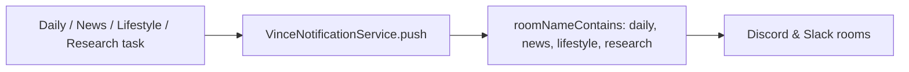
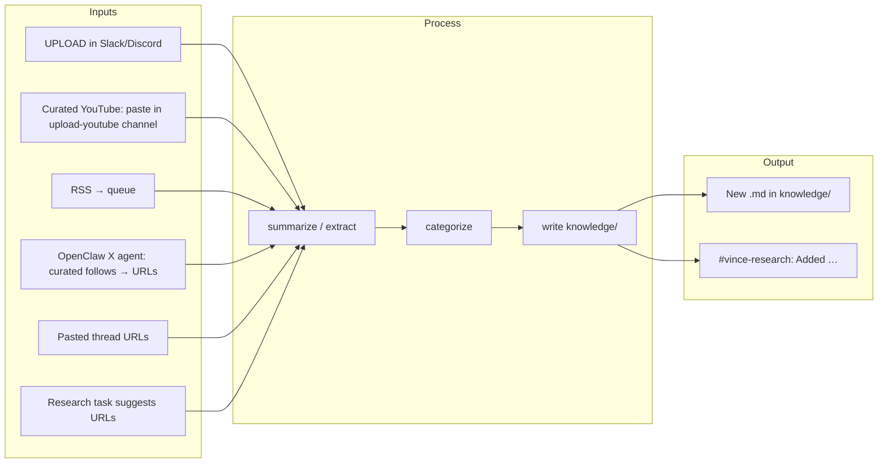

# Plan: Slack, Discord & Automated Deep Research / Knowledge Expansion

**Focus:** Set up Slack and Discord for VINCE, improve the knowledge base, and automate deep research. **X is our biggest source of news and insights; the X API is too expensive.** The key feature is **Clawdbot/OpenClaw**: a dedicated X account following our curated list (decade of curation) + Birdy → surface threads/URLs → VINCE knowledge pipeline (no X API cost). Plan also covers RSS, research queue, and Grok/research tasks.

---

## Executive summary (one page)

| Goal | What we do | Success = |
|------|------------|-----------|
| **Slack & Discord** | Configure bots, create channels, set env; use existing push routing for research. | Daily report (18:00 UTC), news (07:00), lifestyle (08:00) land in correct channels; research digests can go to `#vince-research`. |
| **Step one: Knowledge tests & improvement** | Extensive tests for current knowledge (structure, coverage, methodology); script to automate health report and safe improvements. | CI passes; health report clean or review-queue defined; new content meets same bar. |
| **Knowledge quality** | Enforce methodology-over-data; frontmatter; clawdbot as playbooks; prompt templates for research/X. | Every ingested doc has source/category; agents cite frameworks, not stale numbers. |
| **Deep research** | Re-enable Grok Expert; add research-daily task; optional research-queue processor. | One research brief or Grok pulse per day → channel and/or `knowledge/`. |
| **X → knowledge** | **No X API** (too expensive). **Clawdbot is the key:** dedicated X account + curated follow list (decade of curation) + Birdy → surface threads/URLs → VINCE knowledge pipeline. | Thread/link URLs from OpenClaw feed into `knowledge/`; X remains main source without API cost. |
| **Curated YouTube** | Paste links in `#vince-upload-youtube`; VINCE ingests (transcript + summary). Manual curation, no watching. | YouTube backlog becomes knowledge without watching. |
| **Expansion loop** | UPLOAD + curated YouTube channel + queue + (later) X → ingest → categorize → write → notify. | New content in `knowledge/` with optional “Added: …” in `#vince-research`. |

**Key insight:** `VinceNotificationService` already supports any keyword via `roomNameContains`. Create a channel whose name contains `research` (e.g. `#vince-research`) and call `push(text, { roomNameContains: "research" })` — no service code change needed.

**Code touchpoints (when implementing):**

| Change | Files |
|--------|--------|
| **Step one: Knowledge tests** | Extend `src/plugins/plugin-vince/src/__tests__/knowledge.integration.test.ts`; add `knowledge.structure.test.ts` (frontmatter, knowledge note, quality rules). Run `knowledgeQuality.e2e.test.ts` for A/B. |
| **Step one: Automate improvement** | New: `scripts/knowledge-health.ts` — scan `knowledge/**/*.md`, report + optional safe auto-fix; optional `knowledge/internal-docs/knowledge-review-queue.md`. |
| Register new task | `src/plugins/plugin-vince/src/index.ts` (add `registerResearchDailyTask` / `registerGrokExpertTask` in init). |
| Research daily task | New: `src/plugins/plugin-vince/src/tasks/researchDaily.tasks.ts`. |
| Grok → knowledge file | `src/plugins/plugin-vince/src/tasks/grokExpert.tasks.ts` (add file write + push with `roomNameContains: "research"`). |
| Research queue processor | New script or task: read `knowledge/internal-docs/research-queue.txt`, call ingest, mark done. |
| Document research channel | `NOTIFICATIONS.md`, `DISCORD.md` (add “research” keyword). |
| **X layer (no API)** | **OpenClaw + Birdy + curated follows** — see `knowledge/clawdbot/x-research-agent-curated-follows.md`. Pipeline: OpenClaw → URLs → VINCE queue/UPLOAD. |

---

## Table of contents

1. [Slack & Discord setup](#1-slack--discord-setup)
2. [Knowledge base improvement](#2-knowledge-base-improvement)
3. [Deep research automation (clawdbot-inspired)](#3-deep-research-automation-clawdbot-inspired)
4. [X (Twitter) research & knowledge pipeline](#4-x-twitter-research--knowledge-pipeline)
5. [Automated knowledge expansion](#5-automated-knowledge-expansion)
6. [Implementation order & checklist](#6-implementation-order--checklist)
7. [Risks, costs & rollback](#7-risks-costs--rollback)
8. [Specs & templates](#8-specs--templates)

---

## 1. Slack & Discord setup

### 1.1 Current state

- **Discord:** Plugin `@elizaos/plugin-discord` is in `package.json`; loaded only when `DISCORD_API_TOKEN` is set (`src/agents/vince.ts`).
- **Slack:** `@elizaos-plugins/client-slack` is in `package.json`; loaded only when `SLACK_BOT_TOKEN` is set.
- **Push routing:** `VinceNotificationService` pushes to rooms by **channel name keywords**: `daily`, `news`, `lifestyle`, `alerts` (see NOTIFICATIONS.md, DISCORD.md). Any new keyword (e.g. `research`) works by creating a channel whose name contains it and passing `roomNameContains: "research"`.

**Push flow:**



### 1.2 Discord setup steps

| Step | Action |
|------|--------|
| 1 | Create app at [Discord Developer Portal](https://discord.com/developers/applications) → Bot → copy **Token** and **Application ID**. |
| 2 | In Bot settings: enable **Message Content Intent** (required for reading commands). |
| 3 | OAuth2 → URL Generator: scopes `bot`, `applications.commands`; permissions: Send Messages, Read Message History, Embed Links, Attach Files, Use Slash Commands (or minimal needed). |
| 4 | Invite bot to server using generated URL. |
| 5 | Create channels per DISCORD.md: e.g. `#vince-daily-reports`, `#vince-news`, `#vince-lifestyle`, `#vince-alerts`, `#general-gm`. |
| 6 | In `.env`: `DISCORD_APPLICATION_ID=<id>`, `DISCORD_API_TOKEN=<token>`. |
| 7 | Restart: `bun start`; confirm bot online and push to channels with matching names. |

### 1.3 Slack setup steps

| Step | Action |
|------|--------|
| 1 | [Slack API](https://api.slack.com/apps) → Create New App → From scratch; pick workspace. |
| 2 | **OAuth & Permissions:** Bot Token Scopes: `chat:write`, `channels:read`, `channels:join`, `groups:read`, `im:read`, `im:history`, `channels:history`, `app_mentions:read`, `users:read`. |
| 3 | **Socket Mode** (recommended): Enable; create **App-Level Token** with `connections:write`; save as `SLACK_APP_TOKEN`. |
| 4 | Install to workspace; copy **Bot User OAuth Token** → `SLACK_BOT_TOKEN`. |
| 5 | Create channels: e.g. `#vince-daily-reports`, `#vince-news`, `#vince-alerts`, `#vince-research` (for research/knowledge feeds). |
| 6 | Invite bot to those channels (`/invite @VINCE`). |
| 7 | In `.env`: `SLACK_BOT_TOKEN=xoxb-...`, `SLACK_APP_TOKEN=xapp-...`. |
| 8 | Restart; verify bot in channels and that scheduled pushes (daily, news, lifestyle) land in correct channels. |

### 1.4 Add a research/knowledge channel

- **Discord:** e.g. `#vince-research` or `#knowledge-drops` — for automated “deep research of the day”, X thread summaries, and “new knowledge added” digests.
- **Slack:** Same idea: `#vince-research` or `#knowledge-drops`.
- **Routing:** No code change needed. `VinceNotificationService.push(text, { roomNameContains: "research" })` already targets any room whose name contains `research` (see `notification.service.ts` lines 82–88). Create a channel with “research” in the name and have research tasks call `push(..., { roomNameContains: "research" })`.

### 1.5 Environment variables (consolidated)

| Variable | Required | Used by | Notes |
|----------|----------|---------|--------|
| `DISCORD_APPLICATION_ID` | For Discord | ElizaOS Discord plugin | Developer Portal → Application ID |
| `DISCORD_API_TOKEN` | For Discord | ElizaOS Discord plugin | Bot token; enable Message Content Intent |
| `SLACK_BOT_TOKEN` | For Slack | client-slack | `xoxb-...` from OAuth |
| `SLACK_APP_TOKEN` | For Slack (Socket Mode) | client-slack | `xapp-...`; scope `connections:write` |

Agent loads Discord/Slack only when the corresponding token is set (`src/agents/vince.ts` ~L58–60).

### 1.6 Success criteria (Slack & Discord)

- [ ] Bot appears online in Discord and/or Slack.
- [ ] At 18:00 UTC a daily report appears in channels whose name contains `daily`.
- [ ] At 07:00 UTC a news briefing appears in channels whose name contains `news` (when Mando fresh).
- [ ] At 08:00 UTC a lifestyle briefing appears in channels whose name contains `lifestyle`.
- [ ] Creating a channel named `#vince-research` and calling `push(text, { roomNameContains: "research" })` from a task delivers to that channel.

---

## 2. Knowledge base improvement

### 2.0 Step one: Knowledge tests & automated improvement (Phase 0)

**Before** scaling Slack/Discord and new automation, the foundation is: **extensive tests for current knowledge** and **a way to automate improving it where needed**. This is Phase 0.

#### 2.0.1 Extensive tests for current knowledge

- **Structure tests**
  - Required frontmatter: `source` or `title`, `category` (or infer from path), `created` or `ingestedWith` where applicable.
  - Standard **knowledge note block** at top (methodology/framework, numbers illustrative; see KNOWLEDGE-USAGE-GUIDELINES.md).
  - Clear `##` section headers for RAG chunking; no empty or near-empty files.
- **Domain coverage tests** (extend existing)
  - Per-domain keyword presence (options: strike, IV, funding; perps: funding, liquidation; etc.) — already in `knowledge.integration.test.ts`.
  - Minimum file counts per domain; no directories that should have content are empty.
- **Quality / methodology tests**
  - Files contain methodology/framework language (e.g. “framework”, “when to”, “how to interpret”) and are not purely data/narrative.
  - Autatable parts of **KNOWLEDGE-QUALITY-CHECKLIST**: e.g. “Methodology and Framework” section present, relative thresholds (not absolute prices) where applicable, red-flag patterns (e.g. “BTC is at $X” as sole content) flagged.
- **Integration / E2E tests**
  - Existing: `knowledge.integration.test.ts` (structure, coverage, retrieval); `knowledgeQuality.e2e.test.ts` (A/B with/without knowledge, Knowledge Integration score).
  - Extend: more domains, more queries that explicitly ask for “framework from knowledge”; regression tests when adding new knowledge.

**Location:** Extend `src/plugins/plugin-vince/src/__tests__/knowledge.integration.test.ts` and add (or extend) a **knowledge structure/quality** test file (e.g. `knowledge.structure.test.ts`) that runs over all `knowledge/**/*.md` and checks frontmatter, knowledge note, and checklist-derived rules. Run in CI (e.g. `bun test` in plan).

#### 2.0.2 Automate improving knowledge where needed

- **Detection (script or task)**
  - Scan all `knowledge/**/*.md`; report or write a **knowledge health report**: missing frontmatter, missing knowledge note, wrong/missing category, files that fail structure/quality rules, duplicate or near-duplicate titles/URLs.
  - Optionally: severity (blocking vs suggestion). Output: markdown report or JSON for tooling.
- **Auto-fix where safe**
  - Add **standard knowledge note block** to files that lack it (with a clear marker so we don’t double-add).
  - Infer and add **category** from path or content when missing.
  - Add minimal **frontmatter** (e.g. `title`, `category`, `created`) when missing; leave existing frontmatter intact.
- **Review queue**
  - Files that can’t be auto-fixed (e.g. no methodology section, too data-heavy) go into a **review list** (e.g. `knowledge/internal-docs/knowledge-review-queue.md` or a script output). Humans or a later “improvement” pass (e.g. LLM-assisted rewrite with prompt from KNOWLEDGE-QUALITY-GUIDE) address them.
- **CI gate**
  - Phase 0 success = structure tests pass and health report has no “blocking” issues (or count below threshold). New ingest (UPLOAD, ingest-urls) can optionally run the same checks before merge.

**Deliverables for Phase 0:** (1) Extended/new test suite that runs in CI. (2) Script `scripts/knowledge-health.ts` (or similar) that scans knowledge, produces a health report, and optionally applies safe auto-fixes. (3) Document or update KNOWLEDGE-QUALITY-CHECKLIST with “automated” vs “manual” checks. (4) Optional: `knowledge-review-queue.md` format and a way to tick off items as improved.

### 2.1 Principles (already in KNOWLEDGE-USAGE-GUIDELINES.md)

- Knowledge = **methodologies and frameworks**, not current data.
- Agents use knowledge for **how to think**; use actions/APIs for **current data**.
- Essays and numbers in knowledge are **illustrative**; avoid quoting them as if current.

### 2.2 Structural improvements

| Area | Action |
|------|--------|
| **Directory map** | Keep `knowledge/README.md` and KNOWLEDGE-USAGE-GUIDELINES.md as single source of truth; ensure every new category (e.g. from ingest) is listed. |
| **Clawdbot context** | Treat `knowledge/clawdbot/` as **operational playbooks** (OpenClaw setup, security, one-click install, practical tips). Use for automation design, not for live market data. |
| **Frontmatter** | All ingested files: `source`, `category`, `ingestedWith`, `created`, `tags`. Scripts and UPLOAD already do this; enforce in batch ingest. |
| **Knowledge note block** | Keep the standard block (historical data, methodology focus) at top of ingested content; already in `ingest-urls.ts` and upload fallback. |
| **Deduplication** | Periodically (manual or script): same URL or same title across categories; merge or tag duplicate. |
| **Prompt templates** | `knowledge/prompt-templates/` — keep tier structure; add templates for “deep research brief” and “X thread → summary” for automation. |

### 2.3 Quality and coverage

- **Gaps:** Identify missing methodology areas (e.g. X/social sentiment frameworks, macro regime + crypto, new L2s) and add one-off essays or ingest runs.
- **RAG:** If using RAG (`settings.ragKnowledge: true`), ensure chunking and embedding dimension match; knowledge is searched by semantics, not just keywords.
- **Testing:** When testing agents, reward answers that apply **frameworks** from knowledge and pull **current data** from actions (see KNOWLEDGE-USAGE-GUIDELINES.md testing section).

---

## 3. Deep research automation (clawdbot-inspired)

Clawdbot/OpenClaw patterns to adopt (from `knowledge/clawdbot/`):

- **Proactive, scheduled tasks** (like “news at 6am”) — we already have daily report, news, lifestyle.
- **RSS + URL ingestion** — OpenClaw uses `openclaw rss add <feed-url>`; we have `ingest-urls.ts` and `VINCE_UPLOAD` for URLs/YouTube.
- **Dedicated channels per topic** — e.g. #news, #scripts, #projects; we use #vince-news, #vince-daily-reports, etc.
- **Birdy (X/Twitter) plugin** — lead/topic discovery on X; we don’t have X yet — see Section 4.
- **Persistent memory / SOUL.MD** — we have character + knowledge; “deep research” could write structured findings into knowledge or a dedicated research log.

### 3.1 Deep research task (new)

- **Purpose:** Once per day (or on schedule), run a “deep research” cycle:
  - Gather context from existing services (regime, fear/greed, top headlines, optional Grok/X).
  - Use LLM to generate 1–3 **research questions** or **topic prompts** (e.g. “Explain funding regime shift in the last 7d”, “Macro drivers of BTC this week”).
  - Option A: **Generate a short research brief** (methodology + key points) and push to `#vince-research` (or `#daily`).
  - Option B: **Output a list of URLs to ingest** (e.g. from a fixed list of Substacks, or from a “research queue”); a separate job runs `ingest-urls.ts` or UPLOAD on those URLs and writes to `knowledge/`.
- **Implementation:** New task worker (e.g. `src/plugins/plugin-vince/src/tasks/researchDaily.tasks.ts`) similar to `newsDaily.tasks.ts` and `dailyReport.tasks.ts`; call market/news services, then LLM; push via `runtime.getService("VINCE_NOTIFICATION_SERVICE").push(text, { roomNameContains: "research" })`. Register in plugin `index.ts` with `registerResearchDailyTask(runtime)` in the same `setImmediate` pattern as daily report/news/lifestyle (~L509–537).

### 3.2 Grok Expert task (already present but disabled)

- **Current:** `src/plugins/plugin-vince/src/tasks/grokExpert.tasks.ts` builds context from many services and can generate “prompt of the day” / research suggestions; registration and action import are commented out in `src/plugins/plugin-vince/src/index.ts` (~L96–97, no `registerGrokExpertTask` in init).
- **Action:** Re-enable and optionally:
  - Run at a fixed time (e.g. 09:00 UTC) via task `updateInterval` + hour check (same pattern as `newsDaily.tasks.ts`).
  - Save output to `knowledge/substack-essays/grok-pulse-YYYY-MM-DD.md` (or `knowledge/prompt-templates/`) with frontmatter and knowledge-note block.
  - Push a one-line summary with `push(text, { roomNameContains: "research" })` so it goes to `#vince-research`.
- **Requires:** `XAI_API_KEY` for Grok; otherwise task can no-op or skip LLM step.

### 3.3 RSS / list-based URL ingestion

- **Idea:** Maintain a list of URLs (RSS feed items, or a curated list of Substacks / blogs). A scheduled task (e.g. weekly) picks N URLs, runs `ingest-urls.ts` (or spawns summarize), and writes to `knowledge/<category>/`.
- **Implementation:**
  - **Queue file:** `knowledge/internal-docs/research-queue.txt` — one URL per line; optional second column for category (e.g. `https://... macro-economy`). Processor appends `.processed` or moves processed URLs to `research-queue.done.txt` to avoid re-ingest.
  - **RSS feeder script:** `scripts/rss-to-queue.ts` — reads `knowledge/internal-docs/rss-feeds.txt` (one feed URL per line), fetches new items, appends URLs to `research-queue.txt`. Use a small RSS parser (e.g. `rss-parser`) or `fetch` + simple XML parse.
  - **Task or cron:** Either a plugin task that reads the queue and spawns `bun run scripts/ingest-urls.ts --file knowledge/internal-docs/research-queue.txt` (with a slice of N URLs and a “processed” marker), or a cron job that runs the script and then the ingest.
- **Clawdbot alignment:** Similar to OpenClaw’s RSS + Birdy for “lead identification”; we use it for **knowledge expansion** rather than sales leads.

---

## 4. X (Twitter) research & knowledge pipeline — Clawdbot as the key (no X API)

**Context:** The X API is too expensive for our use case. X is our **biggest source of news, insights, and knowledge**. The solution is **not** to pay for the API; it is to use **OpenClaw (Clawdbot) with a dedicated X account** and our **curated follow list** (accounts we’ve followed on X/Twitter over the past decade). Clawdbot becomes the X ingestion layer; VINCE stays the brain. See **knowledge/clawdbot/x-research-agent-curated-follows.md**.

### 4.1 Why not the X API

| Option | Verdict | Reason |
|--------|---------|--------|
| **X API (v2)** | **Not used** | Too expensive; our main need is “read timeline of curated follows,” not full search. |
| **Grok API (XAI)** | Use for summarization only | Good for “summarize this thread” when we already have a URL (e.g. from OpenClaw). Not a replacement for timeline access. |
| **Third-party (Apify, Firecrawl, etc.)** | Optional for single-URL fetch | Cost and dependency; use only when we have a specific thread URL to turn into markdown. |

### 4.2 Primary strategy: OpenClaw + dedicated X account + curated follows

| Step | What |
|------|------|
| **1. Dedicated X account** | One account used only for this agent. Follow the curated list; no personal or main brand account (security: [instructions-clawdbot.md](knowledge/clawdbot/instructions-clawdbot.md)). |
| **2. Curated follow list** | The **key asset**: accounts we’ve curated on X over the past decade. Export or recreate that list; the bot account follows those accounts. Timeline = stream from trusted sources. |
| **3. OpenClaw + Birdy** | Run OpenClaw (VPS or Pi per [instructions-clawdbot.md](knowledge/clawdbot/instructions-clawdbot.md)); install Birdy (Twitter/X plugin). Configure with the dedicated X account. Birdy: “add follows and RSS”; we use it for **research and knowledge**, not lead gen. |
| **4. Pipeline to VINCE** | OpenClaw is prompted (e.g. daily) to review timeline, pick top threads/links that are methodology- or insight-heavy, and output URLs. Those URLs are posted to a Discord channel (or Matrix, or written to a file). VINCE’s research queue or UPLOAD ingests them → `knowledge/<category>/`. |

So: **Clawdbot is the key feature** — it gives us “X as primary source” without paying for the X API.

### 4.3 Phased approach (Clawdbot-first)

- **Phase 1 (manual fallback):**  
  - In Discord/Slack, users paste **thread URLs**. VINCE_UPLOAD handles them (summarize/Firecrawl) → `knowledge/`.  
  - Prompt template `knowledge/prompt-templates/x-thread-to-methodology.md` keeps output methodology-oriented.

- **Phase 2 (Clawdbot X agent — primary):**  
  - Set up OpenClaw + Birdy with **dedicated X account**.  
  - Load **curated follow list** (decade of curation) onto that account.  
  - Define pipeline: OpenClaw surfaces thread/link URLs → Discord/Matrix or `research-queue.txt` → VINCE ingest.  
  - Optional: OpenClaw posts “top 3–5 threads today” into a shared channel; human or VINCE queues them for ingest.

- **Phase 3 (full automation):**  
  - OpenClaw runs on a schedule (e.g. daily); selects threads/links from timeline; appends URLs to research queue or posts to channel.  
  - VINCE’s research-queue processor (or human approval) ingests → `knowledge/` + optional “Added: …” in `#vince-research`.

### 4.4 Curated follow list

- **Asset:** The list of X accounts you’ve followed over the years = pre-filtered signal. No API search needed.  
- **Maintenance:** Keep the list in a doc or export (e.g. `knowledge/internal-docs/x-curated-follows.txt`) so you can re-apply if the bot account is recreated.  
- **Scope:** Start with a subset (e.g. 50–200 high-value accounts); expand as needed. The bot’s timeline is the input.

---

## 5. Automated knowledge expansion

### 5.1 Existing levers

- **VINCE_UPLOAD** (Discord/Slack/Telegram): Users paste URLs or “upload: <url>”; summarize runs; file written to `knowledge/<category>/`.
- **Batch ingest:** `bun run scripts/ingest-urls.ts --file urls.txt` (and options: `--extract`, `--youtube`, `--firecrawl`).
- **Scheduled tasks:** Daily report, news, lifestyle already push to channels; no task yet that **writes** to knowledge on a schedule.

**Curated YouTube:** We have a highly curated YouTube backlog but can barely keep up watching. We manually curate links and paste them into a dedicated **upload YouTube knowledge** channel (e.g. `#vince-upload-youtube` or `#youtube-knowledge`) instead of spending half the day watching. VINCE_UPLOAD already handles YouTube URLs (transcript + summary → knowledge). See §5.1.1.

### 5.1.1 Curated YouTube → knowledge (paste in channel, no watching)

- **Channel:** Create `#vince-upload-youtube` or `#youtube-knowledge`. Invite VINCE (or Eliza). Purpose: paste curated YouTube links; bot ingests to knowledge (transcript + summary) so we don’t have to watch.
- **Paste:** Paste a YouTube URL (optionally prefix with `upload:`). VINCE_UPLOAD detects YouTube and runs summarize `--youtube auto` → `knowledge/<category>/`.
- **Batch:** For many links, use `knowledge/internal-docs/youtube-queue.txt` and run `bun run scripts/ingest-urls.ts --file youtube-queue.txt --youtube` (optionally `--length xl`). Mark processed URLs to avoid re-ingest.
- **Env (optional):** `VINCE_UPLOAD_YOUTUBE_SLIDES=true` for slide extraction; `VINCE_UPLOAD_SUMMARY_LENGTH=xl` for longer summaries.

### 5.2 New automation ideas

| Automation | Description | Owner |
|------------|-------------|--------|
| **Research queue processor** | File or DB table of URLs (e.g. `knowledge/internal-docs/research-queue.txt` or a small DB). Task runs daily/weekly; for each new URL, run ingest and append to knowledge; mark URL as processed. | New task + script or existing ingest-urls. |
| **Deep research task** | Section 3.1: generates research brief and/or list of URLs to ingest; optionally triggers ingest for those URLs. | New `researchDaily.tasks.ts`. |
| **Grok pulse → knowledge** | Re-enable Grok Expert; write output to `knowledge/.../grok-pulse-<date>.md` and optionally push summary to Slack/Discord. | Re-enable + small file write in grokExpert.tasks. |
| **X thread → knowledge** | Phase 1: UPLOAD handles pasted thread URLs. Phase 2 (primary): **OpenClaw + Birdy + curated follows** → surface URLs → research queue / Discord → VINCE ingest. No X API. | UPLOAD + Clawdbot X agent (see knowledge/clawdbot/x-research-agent-curated-follows.md). |
| **RSS → queue** | Script or task: parse RSS feeds (e.g. key Substacks), append new article URLs to research-queue; another task processes queue. | New script `scripts/rss-to-queue.ts` + research-queue processor. |
| **Curated YouTube → channel** | Manually curate YouTube links; paste in `#vince-upload-youtube` (or `#youtube-knowledge`). VINCE_UPLOAD ingests (transcript + summary) so we don’t have to watch. Batch: `ingest-urls.ts --file youtube-queue.txt --youtube`. | UPLOAD (existing); channel + docs. |

### 5.3 Knowledge expansion “loop”



1. **Inputs:** User UPLOADs in Slack/Discord; **curated YouTube** (paste links in `#vince-upload-youtube` or `#youtube-knowledge` → ingest without watching); RSS adds URLs to queue; **OpenClaw X agent** (curated follows, no API) surfaces thread/link URLs; pasted thread URLs; deep research task suggests URLs.
2. **Process:** Ingest (summarize / extract) → categorize (LLM or rules) → write to `knowledge/<category>/` with frontmatter and knowledge-note block.
3. **Output:** New files in knowledge; optional notification in `#vince-research`: “Added: macro-economy/ingest-xyz-123.md from <url>”.
4. **Quality:** Periodic review (manual or script): dedupe, tag, or archive low-value ingest; ensure KNOWLEDGE-USAGE-GUIDELINES are respected in prompts.

---

## 6. Implementation order & checklist

### Phase 0: Knowledge tests & automated improvement (Step one)

- [ ] **Extensive tests:** Extend `knowledge.integration.test.ts`; add `knowledge.structure.test.ts` (or equivalent) that checks all `knowledge/**/*.md` for: frontmatter (source/title, category, created where applicable), standard knowledge note block, `##` headers, non-empty content, domain keywords and min file counts.
- [ ] **Quality rules:** Encode automatable parts of KNOWLEDGE-QUALITY-CHECKLIST (methodology section, relative vs absolute numbers, red-flag patterns); run in test suite.
- [ ] **Health script:** Implement `scripts/knowledge-health.ts` (or similar): scan knowledge, report missing frontmatter/note, wrong category, quality failures; optional safe auto-fix (add knowledge note, infer category, minimal frontmatter).
- [ ] **Review queue:** Define format for `knowledge/internal-docs/knowledge-review-queue.md` (or script output) for files needing manual improvement; document “automated vs manual” in KNOWLEDGE-QUALITY-CHECKLIST.
- [ ] **CI:** Ensure `bun test` runs knowledge tests; optionally gate on health report (no blocking issues or count below threshold).
- **Success:** All knowledge structure/coverage tests pass; health script runs and produces a report; safe auto-fixes applied where desired; review queue used for non-auto-fixable files.

### Phase A: Slack & Discord (immediate)

- [ ] Create Discord app and bot; get token + application ID; enable intents.
- [ ] Create channels per DISCORD.md; invite bot; set `DISCORD_APPLICATION_ID`, `DISCORD_API_TOKEN`.
- [ ] Create Slack app; Socket Mode + app token; bot token; scopes; invite to channels.
- [ ] Set `SLACK_BOT_TOKEN`, `SLACK_APP_TOKEN`.
- [ ] Restart VINCE; verify daily report (18:00 UTC) → `#vince-daily-reports`, news (07:00) → `#vince-news`, lifestyle (08:00) → `#vince-lifestyle`.
- [ ] (Optional) Add `#vince-research` and document in DISCORD.md / NOTIFICATIONS.md for future research pushes.
- [ ] Add **`#vince-upload-youtube`** (or `#youtube-knowledge`): paste curated YouTube links; VINCE ingests to knowledge so we don’t have to watch. Document in DISCORD.md (done).

### Phase B: Knowledge hygiene & structure

- [ ] Review KNOWLEDGE-USAGE-GUIDELINES.md and knowledge/README.md; ensure all ingest categories are listed.
- [ ] Add `knowledge/clawdbot/` to README as “operational playbooks (OpenClaw, security, automation patterns)” (already done in knowledge/README.md).
- [ ] Add one prompt template for “X thread → methodology summary” in `knowledge/prompt-templates/` (see §8.3).
- [ ] (Optional) Add `knowledge/internal-docs/research-queue.txt` and `rss-feeds.txt`; document format in this plan (§8.1, §8.2).
- **Success:** New ingest produces files with frontmatter + knowledge note; README directory map includes clawdbot and any new category.

### Phase C: Deep research automation

- [ ] Re-enable Grok Expert task in plugin `index.ts`; set schedule (e.g. 09:00 UTC).
- [ ] Optionally: Grok task writes output to `knowledge/substack-essays/grok-pulse-<date>.md` and pushes one-line summary with `roomNameContains: "research"`.
- [ ] Implement `researchDaily.tasks.ts`: gather context from services → LLM research questions/brief → push with `roomNameContains: "research"` (no notification service code change).
- [ ] (Optional) Implement research-queue processor: read `research-queue.txt` → run ingest-urls or summarize → write to knowledge; mark URLs processed (§8.1).
- **Success:** At least one of Grok or research-daily runs on schedule and a message appears in `#vince-research`.

### Phase D: X (Twitter) and RSS — Clawdbot as primary (no X API)

- [ ] Phase 1: Test VINCE_UPLOAD with 1–2 X thread URLs (and Firecrawl/summarize if needed); confirm output in `knowledge/` with correct category.
- [ ] Document “paste X thread URL in Slack/Discord and say UPLOAD” in README or knowledge docs.
- [ ] (Optional) Script `scripts/rss-to-queue.ts`: read `knowledge/internal-docs/rss-feeds.txt`, fetch new items, append URLs to `research-queue.txt` (§8.2).
- [ ] **Phase 2 (key feature):** Set up **OpenClaw X research agent** per `knowledge/clawdbot/x-research-agent-curated-follows.md`: dedicated X account, Birdy, **curated follow list** (decade of X curation). Pipeline: OpenClaw surfaces thread/link URLs → Discord or `research-queue.txt` → VINCE ingest.
- [ ] (Optional) Add `knowledge/internal-docs/x-curated-follows.txt` (or similar) to document the follow list for the bot account.
- **Success (Phase 1):** Pasting an X thread URL and “upload: <url>” results in a new file under `knowledge/<category>/` with methodology-oriented content.
- **Success (Phase 2):** OpenClaw bot account follows curated list; at least one run surfaces URLs that are then ingested into VINCE knowledge (no X API cost).

### Phase E: Notification routing for research

- [ ] **No service code change needed.** Create channel `#vince-research` (or any name containing `research`). In research/Grok tasks, call `notif.push(text, { roomNameContains: "research" })` (see §1.4).
- [ ] Document in NOTIFICATIONS.md and DISCORD.md: “Channels whose name contains `research` receive research digests and Grok pulse summaries.”

---

## 7. Risks, costs & rollback

### 7.1 Rate limits & ToS

| System | Risk | Mitigation |
|--------|------|------------|
| **Discord** | Rate limits on messages (e.g. 5/5s per channel). | Our pushes are low frequency (daily, news, lifestyle); burst only if many channels. If needed, add 1–2s delay between `sendMessageToTarget` calls. |
| **Slack** | Tier limits (Tier 2: 20/min). | Same; scheduled pushes are well under limit. |
| **X API** | **Not used** — too expensive. We use **OpenClaw + dedicated X account + curated follows** instead (no API cost). |
| **Summarize / LLM** | Token cost per URL. | Use `VINCE_UPLOAD_EXTRACT_ONLY=true` or `--extract` for cheap extract-only ingest where appropriate. |

### 7.2 Cost notes

- **Summarize (ingest-urls / UPLOAD):** Per-URL cost depends on length and whether extract-only. Extract-only is cheap; full summary uses LLM tokens.
- **Grok Expert:** Uses XAI API; one run per day is typically low cost.
- **X API:** Not used. X access via **Clawdbot** (dedicated account + Birdy + curated follows) — no API subscription.
- **Firecrawl:** If used for thread scraping, check plan limits.

### 7.3 Disable flags (rollback / pause)

| Feature | Env var | Effect |
|---------|---------|--------|
| Daily report | `VINCE_DAILY_REPORT_ENABLED=false` | Stops scheduled daily report push. |
| News daily | `VINCE_NEWS_DAILY_ENABLED=false` | Stops news briefing push. |
| Lifestyle daily | `VINCE_LIFESTYLE_DAILY_ENABLED=false` | Stops lifestyle push. |
| Research task | (proposed) `VINCE_RESEARCH_DAILY_ENABLED=false` | Skip research daily task. |
| Grok Expert | Don’t register task, or (proposed) `VINCE_GROK_EXPERT_ENABLED=false` | No Grok pulse. |

### 7.4 Rollback checklist

- Remove or comment out task registration in `plugin-vince/src/index.ts` for the task you want to disable.
- Set env to disable scheduled pushes (above).
- If Slack/Discord misbehave: remove `SLACK_*` / `DISCORD_*` from `.env` and restart — plugins won’t load, pushes no-op.

---

## 8. Specs & templates

### 8.1 Research queue file format

**File:** `knowledge/internal-docs/research-queue.txt` — see also **knowledge/internal-docs/RESEARCH-QUEUE-AND-RSS.md**.

- One URL per line; optional second token for category override (e.g. `https://substack.com/... macro-economy`).
- Lines starting with `#` or empty lines are ignored.
- Processor should move or mark processed lines (e.g. append to `research-queue.done.txt` or prefix with `# DONE `) to avoid re-ingest.

### 8.2 RSS feeds file format

**File:** `knowledge/internal-docs/rss-feeds.txt` — see **knowledge/internal-docs/RESEARCH-QUEUE-AND-RSS.md**.

- One RSS or Atom feed URL per line.
- Script fetches each feed, collects new item URLs (since last run; use a simple `last-run` timestamp file), appends to `research-queue.txt`.

### 8.3 X thread → methodology summary (prompt template)

Add to `knowledge/prompt-templates/` (e.g. `x-thread-to-methodology.md`) for use when summarizing pasted X threads or UPLOAD output:

```markdown
# X thread → methodology summary

When turning an X (Twitter) thread into knowledge:
1. Extract the **argument or framework** (how to think about X), not just facts.
2. State **methodology**: what to look for, how to interpret, what to avoid.
3. Strip ephemeral details (exact prices, “as of today”); keep structure (e.g. "funding > X% suggests …").
4. Output sections: ## Summary (2–3 sentences), ## Methodology, ## Caveats / when to use.
5. Add standard knowledge note: numbers are illustrative; use for frameworks, not current data.
```

### 8.4 Deep research brief (output shape)

For `researchDaily.tasks.ts` or Grok pulse, target output shape:

- **Title:** e.g. “Research pulse YYYY-MM-DD”.
- **Bullets:** 3–5 key questions or findings (methodology-oriented).
- **Optional:** 1–3 URLs to add to research-queue for later ingest.
- **Length:** Short enough for a Discord/Slack message (e.g. 500–800 chars for push; full brief can be in a file).

---

## References

| Doc / path | Purpose |
|------------|---------|
| **DISCORD.md** | Channel structure (IKIGAI, LiveTheLifeTV, Slack). |
| **NOTIFICATIONS.md** | Push behavior, channel names, env vars. |
| **knowledge/KNOWLEDGE-USAGE-GUIDELINES.md** | How agents use knowledge (methodology vs data). |
| **knowledge/clawdbot/** | OpenClaw setup, security, Birdy/X, RSS, channel layout. |
| **knowledge/clawdbot/x-research-agent-curated-follows.md** | **Key feature:** X research agent — dedicated account, curated follow list (decade), Birdy, pipeline to VINCE (no X API). |
| **scripts/ingest-urls.ts** | Batch URL → knowledge with summarize; categories, frontmatter. |
| **src/plugins/plugin-vince/src/actions/upload.action.ts** | VINCE_UPLOAD; URLs/YouTube → knowledge. |
| **src/plugins/plugin-vince/src/services/notification.service.ts** | `push(text, { roomNameContains })`; L82–88 name filter. |
| **src/plugins/plugin-vince/src/tasks/newsDaily.tasks.ts** | Pattern for scheduled push (hour check, notif.push with roomNameContains). |
| **src/plugins/plugin-vince/src/index.ts** | Task registration ~L509–537 (daily, lifestyle, news); add research/Grok here. |
| **knowledge/prompt-templates/x-thread-to-methodology.md** | Prompt template for X thread → methodology summary (§8.3). |
| **knowledge/internal-docs/RESEARCH-QUEUE-AND-RSS.md** | Format and flow for research-queue.txt and rss-feeds.txt. |
| **knowledge/internal-docs/KNOWLEDGE-QUALITY-CHECKLIST.md** | Pre-flight and domain checks; automatable vs manual. |
| **knowledge/internal-docs/KNOWLEDGE-QUALITY-GUIDE.md** | Methodology over data; structure; essay-aware chunking. |
| **src/plugins/plugin-vince/src/__tests__/knowledge.integration.test.ts** | Domain coverage, structure, retrieval tests. |
| **src/plugins/plugin-vince/src/__tests__/knowledgeQuality.e2e.test.ts** | A/B with/without knowledge; Knowledge Integration score. |
| **FEATURE-STORE.md** | Paper bot features; separate from knowledge. |

---

## Quick reference

| What | Where / how |
|------|--------------|
| **Step one: Knowledge** | Run `bun test` (knowledge.integration + knowledge.structure + knowledgeQuality.e2e); run `scripts/knowledge-health.ts` for report and optional auto-fix. |
| Add a push target | Create channel whose name contains keyword; use `push(text, { roomNameContains: "keyword" })`. |
| Disable scheduled push | `VINCE_DAILY_REPORT_ENABLED=false` etc.; or remove task registration in plugin index. |
| Ingest a URL to knowledge | `bun run scripts/ingest-urls.ts <url>` or UPLOAD in Slack/Discord. |
| Research queue | `knowledge/internal-docs/research-queue.txt` (one URL per line); processor marks done. |
| X → knowledge | **No X API.** Phase 1: paste URL + UPLOAD. Phase 2 (primary): **Clawdbot** — dedicated X account + curated follows + Birdy → surface URLs → queue/Discord → VINCE ingest. See knowledge/clawdbot/x-research-agent-curated-follows.md. |

---

*This plan is the single reference for: Slack/Discord setup, knowledge improvement, clawdbot-style deep research, X automation, and automated knowledge expansion. Update this doc as items are completed or priorities change.*
