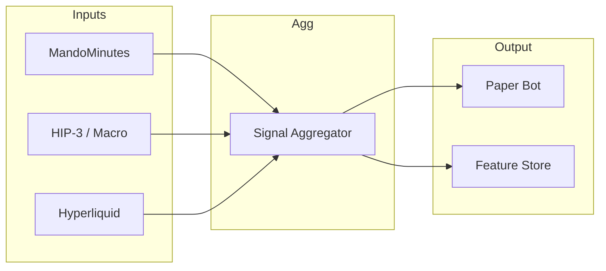

<div align="center">

# VINCE

```
  ██╗   ██╗██╗███╗   ██╗ ██████╗███████╗
  ██║   ██║██║████╗  ██║██╔════╝██╔════╝
  ██║   ██║██║██╔██╗ ██║██║     █████╗  
  ╚██╗ ██╔╝██║██║╚██╗██║██║     ██╔══╝  
   ╚████╔╝ ██║██║ ╚████║╚██████╗███████╗
    ╚═══╝  ╚═╝╚═╝  ╚═══╝ ╚═════╝╚══════╝
```

### *Push, not pull.*

**Unified data intelligence** for options · perps · memes · airdrops · DeFi · lifestyle · NFT floors

*with a **self-improving paper trading bot** at the core*

---

<p>
  <strong>⚡ ALOHA</strong> → vibe check · <strong>📊 PERPS</strong> → signals · <strong>📈 OPTIONS</strong> → posture · <strong>🤖 PAPER BOT</strong> → ML loop
</p>

```
┌──────────────────────────────────────────────────────────────────────────────────┐
│  🚀 elizaos dev     │  📦 bun run deploy:cloud     │  💾 bun run sync:supabase    │
└──────────────────────────────────────────────────────────────────────────────────┘
```

</div>

---

## 📑 Quick Links

| | |
|:---|:---|
| [**FEATURE-STORE**](FEATURE-STORE.md) | ML & paper bot · feature store |
| [**SUPABASE_MIGRATION**](SUPABASE_MIGRATION.md) | Production persistence checklist |
| [**DEPLOY**](DEPLOY.md) | Eliza Cloud · env · troubleshooting |
| [**DISCORD**](DISCORD.md) | Channel structure for VINCE + Eliza (IKIGAI, LiveTheLifeTV, Slack) |
| [**CLAUDE**](CLAUDE.md) | Dev guide (character, plugins, tests) |
| [**plugin-vince/**](src/plugins/plugin-vince/) | README · WHAT · WHY · HOW |
| [**progress.txt**](src/plugins/plugin-vince/progress.txt) | Tracker · backlog |

---

## 📖 Contents

| Section | |
|:---|:---|
| [North Star](#-north-star) | Proactive agent, push not pull |
| [Current Focus](#-current-focus-feb-2026) | ALOHA, ML paper trading |
| [Milestone](#-milestone-full-ml-loop) | Shipped · no redeploy tax |
| [Heart of VINCE](#-heart-of-vince) | signals → trades → learning |
| [Star Feature](#-star-feature) | Self-improving paper bot |
| [Features](#-features) | What matters + actions |
| [Getting Started](#-getting-started) | Install · dev · production |
| [Production](#-production) | Supabase · ML on Cloud |
| [Configuration](#-configuration) | Env · keys · paths |
| [Documentation](#-documentation) | Doc index |
| [Troubleshooting](#-troubleshooting) | DB · SSL · limits |

> **At a glance:** One command (**ALOHA**) → daily vibe check + PERPS + OPTIONS + "trade today?". Paper bot runs in prod, trains when ready, stores models in Supabase — **no redeploy to improve ML.** Supabase Postgres for production persistence.

---

## ◆ North Star

<div align="center">

*You never have to "chat" with VINCE — he pings you.*

</div>

The goal is a **proactive agent** that sends what you need on **Discord or Slack**: day report (ALOHA), trades and reasoning, close results and PnL, optionally thin-floor NFT alerts. Chat remains for deep dives; the default experience is **push, not pull**.

**Why we built this:** Stay in the game without 12+ hours on screens—treat crypto to live well, not be consumed.

→ [Full vision & gap](knowledge/internal-docs/vince-north-star.md) · [Mindset (VINCE + Eliza)](knowledge/internal-docs/why-vince-eliza-mindset.md)

---

## 🎯 Current Focus (Feb 2026)

<table>
<tr>
<td width="50%">

**☀️ ALOHA day report**

Our primary action. One command delivers the daily "vibe check": market temperature, PERPS posture, OPTIONS positioning, and whether the bot should even be trading.

</td>
<td width="50%">

**🤖 Machine-learning paper trading**

Every sprint feeds the paper bot more signal coverage, cleaner features, faster training, better ONNX. **Shipped:** Supabase Postgres migration, retrain + improvement weights, getVibeCheck → paper bot, NASDAQ 24h + macro, relaxed real-time thresholds.

</td>
</tr>
</table>

- **Other actions** — still present, supporting cast. If it doesn't improve the paper strategy or ALOHA briefing, it's deliberately low priority.

<div align="center">

> ***If you only remember one thing:*** *ALOHA in, better ML out.*

</div>

---

## 🚀 Milestone: Full ML Loop

<div align="center">

**We shipped it.** The paper bot runs a **complete ML lifecycle in production** without paying $15 per model update.

</div>

| | What | How |
|:---:|---|---|
| 🗄️ | **Supabase Postgres** | Set `POSTGRES_URL` in `.env`; ElizaOS tables + `plugin_vince.paper_bot_features` live in one DB. Data **persists across redeploys**. → [SUPABASE_MIGRATION.md](SUPABASE_MIGRATION.md) |
| 📦 | **Feature store** | Dual-write to `vince_paper_bot_features` (Supabase) and `plugin_vince.paper_bot_features` (Postgres). JSONL backup always kept. Backfill: `bun run sync:supabase` |
| 🐍 | **Training in prod** | At 90+ complete trades, **TRAIN_ONNX_WHEN_READY** runs the Python pipeline **inside the container**. No local train-and-copy. |
| ☁️ | **Models in Supabase Storage** | Trained `.onnx` + `training_metadata.json` upload to bucket **`vince-ml-models`**. ML service **reloads** immediately. Next redeploy: app pulls latest — **updated ML without another deploy**. |
| ⚖️ | **Improvement weights** | `run-improvement-weights.ts` (with `VINCE_APPLY_IMPROVEMENT_WEIGHTS=true`) aligns aggregator source weights with `training_metadata.json`. Weights in `tuned-config.json`. |
| 🔧 | **One-time setup** | Run `scripts/supabase-migrations-bootstrap.sql` and `scripts/supabase-feature-store-bootstrap.sql`; create bucket `vince-ml-models`; set `POSTGRES_URL` + `SUPABASE_SERVICE_ROLE_KEY` + `SUPABASE_URL` in `.env`. → [DEPLOY.md](DEPLOY.md) · [FEATURE-STORE.md](FEATURE-STORE.md) |

<div align="center">

**TL;DR** · One deploy. Features and models live in Supabase. Training runs on Cloud. New models take effect **without** another $15 redeploy.

</div>

---

## ═══ Heart of VINCE

```
  signals  ──►  trades  ──►  learning  ──►  (repeat)
```

The core is a **multi-factor paper trading pipeline**:

- **15+ signal sources** — CoinGlass, Binance, MarketRegime, News, Deribit, liquidations, Sanbase, Hyperliquid OI cap/funding extreme
- **50+ features per decision** — stored with **decision drivers** ("WHY THIS TRADE")
- **Python training pipeline** — `train_models.py` → ONNX + improvement report (feature importances, suggested signal factors)

Feature store and training script aligned: **hasFundingExtreme** (Binance + Hyperliquid), **hasOICap** (Hyperliquid perps-at-OI-cap); synthetic data uses a 10-source pool so ML sees production variety.



### MandoMinutes · News Sentiment

| | Capability |
|---|:---|
| ✅ | Asset-specific sentiment ("Vitalik sells ETH" affects ETH more than BTC) |
| ✅ | Risk-event dampening (block bullish when critical/warning, boost bearish) |
| ✅ | Price-embedded headlines ("BTC: 75.2k (-4%)") |
| ✅ | Category weighting, headcount-calibrated confidence |
| ✅ | **getVibeCheck()** — 1–2 line vibe (Risk-off/Risk-on/Mixed + salient phrases) at top of dashboard and briefing |
| ✅ | Wired into paper bot context and "WHY THIS TRADE" |
| ✅ | "erases gains" and similar → bearish (NEGATIVE_GAINS_PHRASES override) |
| ✅ | **NASDAQ 24h + macro** (HIP-3 primary, Yahoo fallback) — `news_nasdaqChange` top-5 signal-quality feature |
| ✅ | **Real-time thresholds** relaxed — more sources contribute more often |
| ✅ | **Improvement weights** — NewsSentiment↑, CoinGlass↑, MarketRegime↑ |

→ Logs: `[VINCE] 📡 Signal sources available:` · `[VinceSignalAggregator] ASSET: N source(s) → M factors` · [SIGNAL_SOURCES.md](src/plugins/plugin-vince/SIGNAL_SOURCES.md)

---

## ★ Star Feature: Self-Improving Paper Bot

<div align="center">

*The most novel piece in this repo*

</div>

**Plugin-vince:** 27 services · 20 actions · 2 providers · 1 evaluator — 18 data-source services, 7 fallbacks, 4 ML services (feature store, weight bandit, signal similarity, ONNX inference).

### The Loop

```
┌─────────────┐    ┌──────────────┐    ┌─────────────┐    ┌──────────────┐
│ Paper trade │ ─► │ Feature store │ ─► │ Python train │ ─► │ ONNX deploy  │
└─────────────┘    └──────────────┘    └─────────────┘    └──────────────┘
       ▲                                                                 │
       └──────────────────── bandit · similarity · tuner ◄───────────────┘
```

| # | Component | Details |
|:---:|---|:---|
| 1 | **Paper trading** | Simulated perpetuals (Hyperliquid-style), risk limits, session filters. Goals: $420/day, $10K/month. Targets: BTC, ETH, SOL, HYPE + 34 HIP-3 tradFi assets. |
| 2 | **Feature store** | **50+ features** per decision: market (price, funding, OI, funding 8h delta, OI 24h change, DVOL, RSI, order-book imbalance, bid-ask spread, price vs SMA20), session, signal (factor-derived sentiment, hasFundingExtreme, hasOICap), regime, news (sentiment, risk events, NASDAQ 24h, macro risk-on/off), execution, outcome. → JSONL + Supabase. [DATA_LEVERAGE.md](src/plugins/plugin-vince/DATA_LEVERAGE.md) |
| 3 | **Online adaptation** | Thompson Sampling gets PnL-weighted updates per source on each closed trade. Signal-similarity k-NN: "avoid" → hard filter (trade skipped). Bayesian parameter tuner. |
| 4 | **Offline ML** | `train_models.py` trains XGBoost for **signal quality**, **position sizing**, **TP optimizer**, **SL optimizer** → exports all four to ONNX. |
| 5 | **ONNX at runtime** | Bot loads ONNX for signal-quality and sizing; rule-based fallbacks when models aren't trained. |

### Why Knowledge Matters

Actions supply *current* data (prices, signals). The knowledge base supplies *how to think* — frameworks, strike-selection logic, meme lifecycle. `trenchKnowledgeProvider` pulls relevant knowledge so the LLM interprets through proven lenses, not just echoes numbers.

### Data Leverage

Funding history (8h delta) · rolling SMA20 · Binance depth (book imbalance, spread) · Deribit DVOL/ATR/RSI · **MandoMinutes news** (asset-specific sentiment, price-embedded, risk events, category-weighted). → [ALGO_ML_IMPROVEMENTS.md](src/plugins/plugin-vince/ALGO_ML_IMPROVEMENTS.md)

### Improvements We Claim

1. Market data wired: order-book, SMA20, funding 8h delta, DVOL, **NASDAQ 24h + macro**
2. Book-imbalance filter · SMA20/funding confidence boost · DVOL size cap
3. **getVibeCheck()** → "Headlines: {vibe}" in WHY THIS TRADE
4. **Real-time thresholds** relaxed
5. **Improvement weights** from training metadata
6. **Retrain pipeline** — train_models.py, run-improvement-weights.ts, FEATURE_TO_SOURCE

*We do **not** yet claim improved P&L or win rate—that requires backtest or live results.*

### WHY THIS TRADE Banner

Supporting vs Conflicting factors · "N of M sources agreed (K disagreed)" · ML Quality % · Open window boost · up to 20 factors. News sentiment under Conflicting when going SHORT.

### Resilience

- **Binance 451** — After 3 consecutive 451s, aggregator skips Binance; recovery on 2xx. Use `VINCE_BINANCE_BASE_URL` for proxy.
- **Fetch timeouts** — 12s; one slow source does not block aggregation.

→ Implementation: [src/plugins/plugin-vince/](src/plugins/plugin-vince/)

---

## 📌 Features

| | Feature | |
|:---:|---|:---|
| ☀️ | **ALOHA** | Single command → vibe check + PERPS pulse + OPTIONS posture + "should we trade today?" |
| 🤖 | **Self-improving paper bot** | ML loop; no live execution; every trade stored and learnt from |
| 👤 | **Teammate context** | USER/SOUL/TOOLS/MEMORY keep responses in character |
| 📚 | **Knowledge ingestion** | `VINCE_UPLOAD` + `scripts/ingest-urls.ts` → summarize → `knowledge/` (URLs, YouTube, PDF, podcast). See [scripts/README.md](scripts/README.md) |
| 💬 | **Chat mode** | `chat: <question>` → pulls from `knowledge/` and trench frameworks |
| 📦 | **Other actions** | NEWS, MEMES, TREADFI, LIFESTYLE, NFT, INTEL, BOT, UPLOAD — heritage, lightly maintained |

### Action Status

| Priority | Action |
|:---:|---|
| ⭐ | **ALOHA** (includes PERPS & OPTIONS) — Core value |
| 📊 | **VINCE_PERPS / VINCE_OPTIONS** — Used inside ALOHA; subcomponents |
| 📋 | **Everything else** — Heritage, not product focus |

---

## ▶ Getting Started

```bash
bun install
bun run build
cp .env.example .env   # add API keys

# Development (hot-reload)
elizaos dev

# Or start once (uses Postgres when POSTGRES_URL set)
bun start
```

---

## 🛠 Development

```bash
elizaos dev          # Hot-reload (recommended)
bun start            # Production start (migration bootstrap when POSTGRES_URL set)
elizaos test         # Run tests
```

### Key Scripts

| Script | Purpose |
|:---|:---|
| `elizaos dev` | Hot-reload development |
| `bun start` | Production start (runs migration bootstrap when `POSTGRES_URL` set) |
| `bun run deploy:cloud` | Deploy to Eliza Cloud |
| `bun run sync:supabase` | Backfill local JSONL features to Supabase |
| `bun run db:check` | Verify DB migrations |
| `bun run db:bootstrap` | Run DB bootstrap (Postgres) |
| `bun run scripts/ingest-urls.ts --file urls.txt` | Batch ingest URLs/YouTube into `knowledge/` |

### Web UI (Otaku-style frontend)

- **`bun start`** starts the API (port 3000) and the VINCE chat/dashboard UI (port **5173**). **Open http://localhost:5173** for the full UI (sidebar, chat, Quick Start).
- If you see the **"Invite code" / "Gated access"** screen, you're on the default ElizaOS dashboard (e.g. from `elizaos start` or port 3000 before the custom UI is built). Use **http://localhost:5173** after `bun start`, or run `bun run start:static` and use port 3000 after building the frontend.

---

## ☁ Production (Supabase / Postgres)

<div align="center">

**Supabase migration is ready.** Set `POSTGRES_URL` + `SUPABASE_SERVICE_ROLE_KEY` + `SUPABASE_URL` in `.env`.

Data **persists across redeploys**. → [SUPABASE_MIGRATION.md](SUPABASE_MIGRATION.md) · Backfill: `bun run sync:supabase`

</div>

1. **`.env`** — `POSTGRES_URL` (port 5432, direct), `SUPABASE_SERVICE_ROLE_KEY`, `SUPABASE_URL` (required if using pooler)
2. **Bootstrap SQL** — `scripts/supabase-migrations-bootstrap.sql` and `scripts/supabase-feature-store-bootstrap.sql` in Supabase SQL Editor
3. **Verify** — `bun run db:check` (tests the migration query; we've run this successfully)
4. **Run** — `bun start`
5. **Deploy** — `bun run deploy:cloud` passes vars from `.env` → [DEPLOY.md](DEPLOY.md)

### ML on Eliza Cloud

**Recommended:** Train on Cloud, models in Supabase. Bot trains in container at 90+ trades, uploads to `vince-ml-models`, reloads ML. Next redeploy pulls latest — no extra deploy for new models.

**Alternative:** Ship models in repo — copy `.onnx` + `training_metadata.json` into `src/plugins/plugin-vince/models/`, commit, deploy. → [models/README.md](src/plugins/plugin-vince/models/README.md)

### Test Structure

```
src/
  __tests__/              # All tests live inside src
    *.test.ts             # Component tests (Bun)
    e2e/                  # E2E tests (ElizaOS runner)
      project-starter.e2e.ts
      README.md
  index.ts                # Export: tests: [ProjectStarterTestSuite]
```

---

## 🧪 Testing

| Type | Location | Runner |
|:---|:---|:---|
| **Component** | `src/__tests__/*.test.ts` | Bun native · fast · mocks |
| **E2E** | `src/__tests__/e2e/*.e2e.ts` | ElizaOS · real runtime · PGLite |

```bash
elizaos test              # All
elizaos test component    # Component only
elizaos test e2e          # E2E only
```

---

## ⚙ Configuration

| What | Where |
|:---|:---|
| VINCE character & agent | `src/agents/vince.ts` |
| Paper bot, ML, actions | `src/plugins/plugin-vince/` |
| Teammate context | `knowledge/teammate/` — USER.md, SOUL.md, TOOLS.md |
| Dynamic config | `dynamicConfig.ts` — tuned via `tuned-config.json` |

### Key Env Vars

| Variable | Purpose |
|:---|:---|
| `POSTGRES_URL` | Supabase/Postgres. Empty = PGLite |
| `SUPABASE_SERVICE_ROLE_KEY` | Feature-store dual-write, ML bucket |
| `SUPABASE_URL` | Optional if direct; required if pooler |
| `VINCE_PAPER_AGGRESSIVE` | `true` = higher leverage, $210 TP, 2:1 R:R |
| `VINCE_PAPER_ASSETS` | e.g. `BTC` or `BTC,ETH,SOL` |
| `VINCE_APPLY_IMPROVEMENT_WEIGHTS` | `true` = align weights with training metadata |
| `VINCE_BINANCE_BASE_URL` | Proxy for Binance in 451 regions |

---

## 📚 Documentation

| Doc | Purpose |
|:---|:---|
| [FEATURE-STORE.md](FEATURE-STORE.md) | Paper bot feature storage, training |
| [SUPABASE_MIGRATION.md](SUPABASE_MIGRATION.md) | Production persistence checklist |
| [DEPLOY.md](DEPLOY.md) | Eliza Cloud, env, troubleshooting |
| [DISCORD.md](DISCORD.md) | Channel structure (IKIGAI, LiveTheLifeTV, Slack) |
| [CLAUDE.md](CLAUDE.md) | ElizaOS dev guide |
| [TREASURY.md](TREASURY.md) | Cost coverage, profitability |
| [plugin-vince/README](src/plugins/plugin-vince/README.md) | WHAT · WHY · HOW · CLAUDE |
| [SIGNAL_SOURCES.md](src/plugins/plugin-vince/SIGNAL_SOURCES.md) | Aggregator sources, contribution rules |
| [IMPROVEMENT_WEIGHTS_AND_TUNING.md](src/plugins/plugin-vince/IMPROVEMENT_WEIGHTS_AND_TUNING.md) | Data-driven weights |
| [DATA_LEVERAGE.md](src/plugins/plugin-vince/DATA_LEVERAGE.md) | Feature coverage |
| [ALGO_ML_IMPROVEMENTS.md](src/plugins/plugin-vince/ALGO_ML_IMPROVEMENTS.md) | ML roadmap |
| [models/README](src/plugins/plugin-vince/models/README.md) | Ship ONNX |
| [BINANCE_DATA_IMPROVEMENTS](src/plugins/plugin-vince/BINANCE_DATA_IMPROVEMENTS.md) | Binance endpoints, 451 proxy |
| [HYPERLIQUID_ENDPOINTS](src/plugins/plugin-vince/HYPERLIQUID_ENDPOINTS.md) | HL endpoints |
| [progress.txt](src/plugins/plugin-vince/progress.txt) | Tracker, backlog |
| [Frontend docs](src/frontend/docs/README.md) · [progress.txt](src/frontend/progress.txt) | Chat UI, Market Pulse, quick start, reference docs, status |

---

## ◇ Alternatives & related

### Honcho

We evaluated [Honcho](https://docs.honcho.dev) and **do not use it**.

| Honcho | VINCE / ElizaOS |
|:---|:---|
| Peers + Sessions | Entities, rooms, participants |
| Representations (reasoning over messages) | Evaluators (facts, reflection) + memory |
| Managed or self-hosted memory service | DB adapter (Postgres/PGLite) + Supabase feature store |

Eliza gives us memories, embeddings, evaluators, entities. The paper bot uses the **feature store** (Supabase); that's the right place for trading state. Adding Honcho would duplicate what we have without filling a clear gap.

**When Honcho could make sense:** (1) Formal reasoning over conversations beyond evaluators, (2) managed memory for a new product, (3) prototyping a separate agent from scratch. → [Honcho agent skills](https://docs.honcho.dev/v3/documentation/introduction/vibecoding#agent-skills)

### OpenClaw, Pi, and Eliza + Pi patterns

**OpenClaw** is not an agent framework—it's a wrapper around another agent called **Pi** (a coding agent). It started as a relay for agents before becoming Clawd. The killer combo: Pi + Claude Skills. Most of the rest is adapters.

| OpenClaw / Pi | ElizaOS |
|:---|:---|
| Memory, connectors (APIs, chats), personality | Very similar—different packaging |
| Pi: CLI everything | MCP + plugin tool-calling |

**The big difference:** ElizaOS is heavy on **MCP and tool calling from plugins**. Pi leans into "CLI everything"—simpler, less ceremony. Both are valid.

If you're looking for more coding-agent simplicity, the target is **Eliza + Pi patterns**, not Eliza with OpenClaw. The ElizaOS maintainers are working on an Eliza code orchestrator in that direction. OpenClaw-on-ElizaOS (swapping Pi for Eliza) exists and may be published—no huge advantages or disadvantages either way.

---

## ⚠ Troubleshooting

### Database migration failed

If you see:

```
Failed query: CREATE SCHEMA IF NOT EXISTS migrations
```

**Verify first:** `bun run db:check` — if it succeeds, migrations are fine; if it fails, it prints the real error (e.g. SSL, wrong port).  
**Fix:** `POSTGRES_URL` to **direct** connection (port 5432, not 6543). Add `?sslmode=verify-full`. With Supabase: use the **direct** connection string from Dashboard → Settings → Database (port 5432), not the pooler (6543). Then `bun start` (runs bootstrap).  
**Local-only:** Leave `POSTGRES_URL` empty → PGLite.  
**SSL error:** `POSTGRES_SSL_REJECT_UNAUTHORIZED=false` (opt-in).

→ [DEPLOY.md](DEPLOY.md)

### Known Limitations

| | Limitation | Notes |
|:---:|---|:---|
| 🔑 | XAI/Grok | API key required |
| 📊 | Nansen | 100 credits/month |
| 📈 | Sanbase | 1K calls/month |
| 🌐 | Binance 451 | Use `VINCE_BINANCE_BASE_URL` proxy |
| 🤖 | ONNX | Active when `.onnx` present; run `train_models.py` |
| 🛡️ | Circuit breakers | Not validated with live trading |

---

<div align="center">

## ═══════════════════════════════════════
## 📋 QUICK REFERENCE
## ═══════════════════════════════════════

| | | |
|:---|:---|:---|
| **Run** | `elizaos dev` | `bun start` |
| **Deploy** | `bun run deploy:cloud` | |
| **Backfill** | `bun run sync:supabase` | |
| **DB** | `bun run db:check` | `bun run db:bootstrap` |
| **Feature store** | `vince_paper_bot_features` | `plugin_vince.paper_bot_features` |
| **ML bucket** | `vince-ml-models` | |
| **Postgres** | port 5432 (direct) | |
| **Train** | `train_models.py --data .elizadb/.../features --output .../models` | |
| **Weights** | `VINCE_APPLY_IMPROVEMENT_WEIGHTS=true bun run .../run-improvement-weights.ts` | |

---

*Built with [ElizaOS](https://github.com/elizaos/eliza) · [summarize](https://github.com/IkigaiLabsETH/summarize)*

</div>
