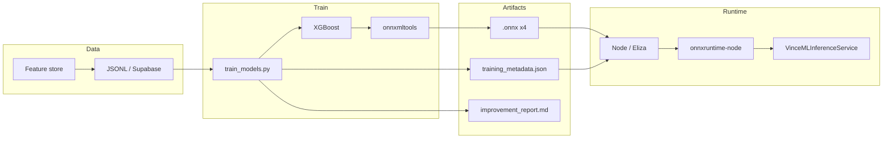

<div align="center">

# ONNX in VINCE

```
   ██████╗ ███╗   ██╗███╗   ██╗██╗  ██╗
  ██╔═══██╗████╗  ██║████╗  ██║╚██╗██╔╝
  ██║   ██║██╔██╗ ██║██╔██╗ ██║ ╚███╔╝ 
  ██║   ██║██║╚██╗██║██║╚██╗██║ ██╔██╗ 
  ╚██████╔╝██║ ╚████║██║ ╚████║██╔╝ ██╗
   ╚═════╝ ╚═╝  ╚═══╝╚═╝  ╚═══╝╚═╝  ╚═╝
```

### *Train once, run anywhere.*

**Open Neural Network Exchange** — the portable format that powers VINCE’s ML paper trading: signal quality, position sizing, take-profit, and stop-loss — without framework lock-in or redeploy tax.

*Faster training, better ONNX → quicker predictions on market signals.*

---

<p>
  <strong>🔗 Interop</strong> → no lock-in · <strong>📐 Graph</strong> → portable ops · <strong>⚡ Runtime</strong> → low-latency inference · <strong>🤖 Paper bot</strong> → four models, one format
</p>

```
┌──────────────────────────────────────────────────────────────────────────────────┐
│  🐍 train_models.py     │  📦 onnxmltools → .onnx     │  🚀 onnxruntime-node     │
└──────────────────────────────────────────────────────────────────────────────────┘
```

</div>

---

## 📑 Quick Links

| | |
|:---|:---|
| [**FEATURE-STORE**](FEATURE-STORE.md) | Where training data lives · 90+ trades for ONNX |
| [**plugin-vince/models/**](../src/plugins/plugin-vince/models/README.md) | Ship ONNX for Cloud · copy after training |
| [**train_models.py**](../src/plugins/plugin-vince/scripts/train_models.py) | XGBoost → ONNX pipeline |
| [**mlInference.service**](../src/plugins/plugin-vince/src/services/mlInference.service.ts) | Load and run ONNX at runtime |
| [**README**](../README.md) | Full ML loop · Supabase · deploy |

---

## 📖 Contents

| Section | |
|:---|:---|
| [What is ONNX?](#-what-is-onnx) | Format, ecosystem, why it matters |
| [Key aspects](#-key-aspects) | Interoperability, model representation, ecosystem |
| [Why ONNX in VINCE](#-why-onnx-in-vince) | Paper bot, four models, no redeploy |
| [Pipeline](#-pipeline-train--export--deploy) | Train → export → deploy flow |
| [Implementation notes](#-implementation-notes) | Operators, feature names, runtime |
| [Insights & recommendations](#-insights--recommendations) | Novelty, VC/commercialization, bull vs bear (VC path), improvement roadmap |
| [Quick reference](#-quick-reference) | Commands, paths, fallbacks |

---

## ◆ What is ONNX?

**ONNX (Open Neural Network Exchange)** is an open format for representing machine learning models. It solves **framework lock-in**: you can train in PyTorch, TensorFlow, or (as in VINCE) **XGBoost via onnxmltools**, then run the same model in **ONNX Runtime** on CPUs, GPUs, or edge devices—with one file, one API.

| Property | Description |
|:---|:---|
| **Format** | Graph of computational nodes (ops like matmul, activations, tree ensembles) with inputs, outputs, and metadata |
| **Portability** | Same `.onnx` file runs in Node (`onnxruntime-node`), Python, C++, mobile, cloud |
| **Ecosystem** | Microsoft, Meta, AWS, and many others; ONNX Runtime provides optimized inference (speed, latency) |

For **real-time** applications like a paper trading bot, low-latency inference is critical: the bot evaluates signal quality, position size, and TP/SL in milliseconds so decisions keep up with market data (e.g. NASDAQ, macro, funding).

---

## 🔑 Key Aspects

### Interoperability

Train in one framework, deploy in another—no vendor lock-in. In VINCE we train **XGBoost** in Python (`train_models.py`), export to ONNX with **onnxmltools**, and run inference in **Node** via `onnxruntime-node`. The same `.onnx` files can be consumed by other runtimes (e.g. Python services, mobile) if we ever split stacks.

### Model representation

ONNX models are **directed graphs**:

- **Nodes** = operators (e.g. tree ensemble for XGBoost, convolutions for CNNs)
- **Edges** = data flow (tensors)
- **Inputs / outputs** = named; in our export we use `input` / `output` for compatibility with `onnxruntime-node`

This makes models easy to optimize (fusion, quantization) and to validate across runtimes.

### Ecosystem

| Player | Role |
|:---|:---|
| **ONNX** | Spec + reference implementations |
| **ONNX Runtime** | High-performance execution (CPU/GPU, often faster than framework-native inference) |
| **onnxmltools** | Convert scikit-learn / XGBoost / LightGBM to ONNX |
| **onnxruntime-node** | Node.js binding used by VINCE’s `VinceMLInferenceService` |

---

## 🤖 Why ONNX in VINCE

In our **ML-driven paper trading** setup, ONNX delivers:

| Benefit | How it shows up in VINCE |
|:---|:---|
| **Single artifact** | One `.onnx` per model (signal quality, position sizing, TP optimizer, SL optimizer)—no Python runtime in production for inference |
| **Fast inference** | ONNX Runtime is optimized; we need low latency for per-trade decisions |
| **Quantization path** | ONNX supports quantization for smaller, faster models (future option) |
| **Production without redeploy** | Train in container (TRAIN_ONNX_WHEN_READY), upload to Supabase Storage (`vince-ml-models`), app reloads models—no $15 redeploy per model update |
| **Sharing and tooling** | Same format for local dev, Cloud, and any future service (e.g. Postgres-backed feature store + separate inference service) |

We also get **improvement weights** and **training_metadata.json** (thresholds, feature list, TP performance) from the same pipeline—so the bot improves not only from the four ONNX models but from tuned config and signal weights aligned with training.

### Does ONNX matter? (external perspective)

**Yes—and it’s a strong fit for this pipeline.** ONNX is an open format that lets you train in Python (PyTorch, TensorFlow, XGBoost) and deploy the same model elsewhere without rewriting code. In algo trading that means:

| Aspect | Why it matters for VINCE |
|:---|:---|
| **Interoperability** | Train in Python (richest ML libraries), deploy lightweight ONNX in Node/Eliza—no Python runtime in production for inference. Same `.onnx` works in MQL5 (OnnxRun since 2023), Rust (e.g. Passivbot-style), or web/cloud if we split stacks. |
| **Performance** | ONNX Runtime optimizes inference (e.g. large CPU reductions in real-time apps). For perps, that means faster predictions, lower latency, and efficient backtesting; quantization can further speed high-frequency decisions. |
| **Portability** | Run on CPU/GPU/edge without framework lock-in. Bridges the training script to live inference so the self-improving loop can update models without downtime. |
| **Real-world use** | Common in trading (MQL5 EAs, Rust sentiment/FinBERT ONNX, fraud detection). For 50+ features, conversion overhead is negligible; ONNX future-proofs for mobile/web or multi-runtime. |

Downside is minor conversion overhead for very large models; for our four XGBoost models it’s negligible. Overall, ONNX elevates the setup from a script to a scalable, production-grade path.

---

## 🔄 Pipeline: Train → Export → Deploy



| Step | What | Where |
|:---|:---|:---|
| 1 | **Collect features** | Paper trades → `VinceFeatureStoreService` → `.elizadb/vince-paper-bot/features/*.jsonl` + optional Supabase `vince_paper_bot_features` |
| 2 | **Train** | `train_models.py` (XGBoost) on 90+ records; outputs to `.elizadb/vince-paper-bot/models/` (or custom `--output`) |
| 3 | **Export** | onnxmltools converts each XGBoost model to ONNX; I/O renamed to `input` / `output` for onnxruntime-node |
| 4 | **Deploy** | **Cloud:** task uploads `.onnx` + `training_metadata.json` to bucket `vince-ml-models`, then `reloadModels()`. **Repo:** copy into `src/plugins/plugin-vince/models/`, commit, deploy. |
| 5 | **Inference** | `VinceMLInferenceService` loads `.onnx` from disk (or Supabase on startup if local empty); uses `training_metadata.json` for feature order and thresholds; rule-based fallbacks when no model. |

---

## 📐 Implementation Notes

### ONNX-compatible operators

Not every custom op is supported out-of-the-box. We use **XGBoost → ONNX** via onnxmltools; the converter emits standard ONNX ops (e.g. tree ensemble). If you add custom preprocessing or new model types, check [ONNX operator schemas](https://github.com/onnx/onnx/blob/main/docs/Operators.md) and test with ONNX Runtime.

### Feature names at export

onnxmltools expects **fixed feature names** for XGBoost: `f0`, `f1`, `f2`, … So in `train_models.py` we temporarily set the booster’s feature names to `f0`, `f1`, … before `convert_xgboost`. The **ordered** feature list is written to `training_metadata.json`; at inference, `mlInference.service.ts` builds the input vector in that order so dimensions always match (16, 20, 33+ features).

### Runtime and fallbacks

- **Runtime:** `onnxruntime-node` (optional dependency). If missing or unavailable (e.g. unsupported platform), the service logs and uses **rule-based fallbacks** (signal quality threshold, fixed sizing, rule-based TP/SL).
- **Active when:** Any `.onnx` file is present in the models directory (or loaded from Supabase). No ONNX → 0 models loaded, bot still runs with rules.

### Testing and performance

- **Tests:** `src/plugins/plugin-vince/src/__tests__/mlInference.service.test.ts` — mocks filesystem so no real `.onnx` load; no Bun crash on missing native module.
- **Performance:** For real-time trading, run ONNX Runtime on the same box as the bot; optional future: quantization or GPU if we outgrow CPU.

---

## 📌 Insights & recommendations

Summary of external feedback on the paper trading bot (Hyperliquid perps: BTC, SOL, ETH, HYPE), the self-improving loop, and ONNX’s role.

### Project overview (recap)

The bot combines **15+ signal sources** (CoinGlass, Binance, Deribit, liquidations, Sanbase, Hyperliquid OI/funding extremes, etc.) into **50+ features** per decision, with **“WHY THIS TRADE”** stored for explainability. The **Python training pipeline** (`train_models.py`) outputs ONNX models with options like recency decay, asset balancing, and hyperparam tuning. The **plugin system** (many services, actions, providers) and the **bandit/similarity/tuner** feedback loop support continuous improvement. Parameter tuning (e.g. reducing weights on CoinGlass/CrossVenueFunding, raising minStrength/minConfidence) responds to live metrics; current targets are better win rates (e.g. 40–60%+ with positive expectancy) and positive P&L over longer runs.

### Novelty and positioning

**Not entirely groundbreaking**, but the implementation has **differentiating elements**:

- **Hyperliquid-specific + broad signals:** Tight integration of HL-specific signals (OI cap, funding extremes) with broader sources (Sanbase, MarketRegime, etc.) in a single feature store for ML training.
- **Explicit self-improvement pipeline:** Trades → Feature store → Python training → ONNX deployment → Bandit/similarity/tuner feedback. Many bots use ML; this closed loop with synthetic data for variety and holdout metrics (AUC/MAE/quantile) is more sophisticated than basic rule-based or simple adaptive bots.
- **Plugin-vince extensibility:** Many data sources, fallbacks, and ML services make it more modular than off-the-shelf tools that focus on user-defined rules.

Core ideas (multi-factor signals, ML prediction, iterative learning) are common in algo trading. **Evolutionary rather than revolutionary**—strong for a personal/project repo; patents or unique IP would be needed to stand out academically/commercially.

### VC / commercialization

**Potentially fundable**, but early-stage; needs **traction, scalability, and proof of profitability**. Crypto VC has invested heavily (e.g. $18.9B in 2025; $1.4B in Jan 2026); focus areas include DeFi infra, trading tools, and AI/ML—this bot fits automated trading/DeFi perps. Examples: 3Commas ($40M Series B), Cornix/Mizar, YC-backed trading firms.

VCs typically care about:

- **Market fit:** Hyperliquid perps are niche but growing; expansion to real-money or multi-chain (dYdX, etc.) helps.
- **Metrics:** Backtested Sharpe >1.5, live alpha, or user adoption. A 31% win rate and negative P&L over 16 trades is not compelling—show outperformance vs. hold-BTC and extended backtests.
- **Differentiation:** Self-improvement via ML/ONNX and lower drawdowns in stress regimes can help; add risk controls, on-chain execution, or community plugins.
- **Regulatory:** Ensure compliance if targeting U.S. or regulated markets.

**Barriers:** Deal count dropped sharply YoY; seed/pre-seed is tough. To improve odds: ship an MVP (e.g. open-source core on GitHub), show revenue potential (subscriptions, API), and pitch crypto/web3 VCs (e.g. Hack VC, YC web3). Evolving into a **platform** (e.g. bot marketplace) improves funding potential.

### Bull vs bear: is VC the right path?

For a project like this (paper perps bot, self-improving ML loop, 15+ signals, ONNX pipeline, plugin extensibility), VC can be either a strong lever or a misalignment. Below: bull and bear cases.

#### Bull case — why VC may be the right approach

| Point | Rationale |
|:---|:---|
| **Capital intensity** | Scaling the stack is expensive: premium APIs (CoinGlass, Messari), inference (Claude 4.6), infra, and full-time dev. VC lets you buy runway and better data without bootstrapping from P&L or grants. |
| **Market and timing** | Crypto VC is active in DeFi/trading/AI ($18.9B in 2025; $1.4B+ in Jan 2026). The project fits automated trading and DeFi perps; Hyperliquid and perps are growing. A funded peer set (3Commas, Cornix, Mizar, YC trading firms) shows the category is investable. |
| **Platform upside** | If the product becomes a **platform** (e.g. bot marketplace, shared signal/ML layer, plugin ecosystem), VC scale and network help. VCs pay for optionality on large outcomes; “agent + execution + data” could justify that. |
| **Credibility and hiring** | A lead investor (e.g. Coinbase Ventures, a16z crypto) signals credibility and can attract collaborators, partners, and future hires. Helpful when you want to add ML/trading talent. |
| **Regulatory and compliance** | Perps and trading touch regulation. VC-backed entities often have legal/compliance budgets and incentive to do it right, which reduces solo-founder risk. |

**When it fits:** You’re willing to pursue **traction and metrics** (Sharpe, live alpha, user adoption), **expand scope** (real money, multi-chain, platform), and **trade some ownership and control** for speed and resources.

#### Bear case — why VC may not be the right approach

| Point | Rationale |
|:---|:---|
| **Metrics not ready** | Current state (e.g. 31% win rate, negative P&L over 16 trades) doesn’t meet typical bar (Sharpe >1.5, clear alpha). Raising too early can mean bad terms, distraction from product, or a “no” that burns relationships. Better to improve backtests and live paper first. |
| **Deal environment** | Deal count dropped sharply YoY; seed/pre-seed is harder. Many funds prefer digital-asset treasury (DAT) or infra over pure trading bots. Chasing VC in a tough market can waste time that could go into product or alternative funding (token, grants, revenue). |
| **Alignment and control** | VC expects growth and exit. If the goal is a **sustainable algo/ML lab** or **open-source community** rather than a high-growth company, board and investor expectations can conflict with that. You may give up control and roadmap flexibility. |
| **Alternative funding** | Token (e.g. Bankr/BAGS), grants (protocol, research), or early revenue (API, subscriptions) can fund dev and APIs without dilution. For a single developer or small team, these can be enough to reach proof-of-profitability before considering VC. |
| **Novelty is evolutionary** | The implementation is strong but evolutionary, not clearly patent-level novel. VCs often look for defensibility and category creation; “better ML bot on Hyperliquid” may need more proof (performance, distribution, or platform angle) to command premium valuation. |

**When it fits:** You prefer **keeping full control**, **funding via token/grants/revenue**, and **proving the algo and metrics** before taking on investor expectations and reporting.

#### Summary

| Path | Consider VC when … | Consider non-VC when … |
|:---|:---|:---|
| **Strategy** | You want to scale fast, hire, and build a platform; you’re ready to show traction and own a growth narrative. | You want to stay lean, own the roadmap, and prove edge first; token/grants/revenue can cover costs. |
| **Metrics** | You have (or will soon have) backtested Sharpe, live alpha, or user adoption that meets investor bar. | Win rate and P&L are still improving; you’d rather iterate than pitch. |
| **Outcome** | You’re comfortable with exit/growth expectations and dilution in exchange for capital and network. | You prefer sustainability, community, or open-source impact over maximizing equity value. |

For this project specifically: **bull** = VC is right if you double down on platform, metrics, and scaling and accept dilution and growth pressure. **Bear** = VC is wrong (or premature) if you’d rather improve the algo, fund via token/APIs/grants, and keep control until the system is clearly profitable or clearly platform-ready.

### Improvement recommendations

| Area | Recommendation |
|:---|:---|
| **Performance tuning** | Target **positive P&L** in extended backtests (e.g. 1–2 years). Add **Sharpe ratio** and **max drawdown** to reports and tuning criteria. |
| **Testing / validation** | Use **walk-forward optimization** to limit overfitting. Extend **live forwarding** (real-time paper trading) beyond a small number of trades. |
| **Expansion** | Beyond paper: integrate **real API keys with safeguards**. Add **multi-asset** support and user-facing **“WHY THIS TRADE”** dashboards. |
| **Monetization** | Open-source core for community contributions; premium features (API, dashboards, signals). For VC: deck emphasizing **ML edge** and market size (e.g. $10B+ DeFi perps volume). |
| **Edge cases** | Handle **black swans** (e.g. flash crashes) with **synthetic data** and stress tests in the training/validation pipeline. |

---

## 📋 Quick Reference

| | | |
|:---|:---|:---|
| **Train (local)** | `pip3 install -r scripts/requirements.txt` | `python3 …/train_models.py --data .elizadb/vince-paper-bot/features --output .elizadb/vince-paper-bot/models --min-samples 90` |
| **Models (four)** | `signal_quality.onnx` · `position_sizing.onnx` · `tp_optimizer.onnx` · `sl_optimizer.onnx` | Plus `training_metadata.json` (and optionally `improvement_report.md`) |
| **Ship for Cloud** | Copy from training output into repo | `cp .elizadb/.../models/*.onnx src/plugins/plugin-vince/models/` (+ metadata) → commit → deploy |
| **Cloud (no redeploy)** | Train in container at 90+ trades | Task uploads to `vince-ml-models`, then `reloadModels()`; next deploy pulls latest from bucket |
| **Inference** | `VinceMLInferenceService` | Loads ONNX when present; else rule-based signal quality, sizing, TP/SL |
| **Docs** | [FEATURE-STORE.md](FEATURE-STORE.md) · [models/README](../src/plugins/plugin-vince/models/README.md) | [README.md](../README.md) (full ML loop) |

---

<div align="center">

**TL;DR** · ONNX = portable ML format. We train XGBoost in Python, export to ONNX, run in Node. Four models drive the paper bot; when they’re missing, rules keep it running. Better ONNX tooling and discipline → faster, more reliable predictions for the self-improving loop. See [Insights & recommendations](#-insights--recommendations) for novelty, VC/commercialization, bull vs bear on VC, and improvement roadmap.

*[ONNX](https://onnx.ai/) · [ONNX Runtime](https://onnxruntime.ai/) · [onnxmltools](https://github.com/onnx/onnxmltools)*

</div>
