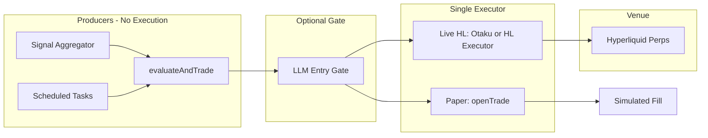

# PRD: Live Hyperliquid Perps Trading Bot

**Status:** Draft  
**Scope:** Roadmap from paper-only to live perps execution on Hyperliquid, informed by [EVClaw](https://github.com/Degenapetrader/EVClaw) and existing VINCE contract.

---

## 1. Goal

Enable **live perpetual futures execution on Hyperliquid** using the same signal and risk pipeline as the paper bot, with a single executor path, full protection layers, and deterministic ops—so we can run a real trading bot with clear safety and auditability.

---

## 2. Current State (Post–EVClaw Plan)

- **Paper:** [VincePaperTradingService](src/plugins/plugin-vince/src/services/vincePaperTrading.service.ts) — `evaluateAndTrade()` → risk/sizing → `openTrade()` (simulated). Single executor path; protection layers 1–2 (symbol validation, duplicate/flip); mode controller; primary signal required; context_adjustment; optional LLM entry gate.
- **Contract:** [docs/TRADING_RUNTIME_CONTRACT.md](TRADING_RUNTIME_CONTRACT.md) — producers never execute; CRON_CONTEXT vs MANUAL_COMMANDS.
- **Live today:** Only [Otaku](docs/OTAKU.md) has a funded wallet; it does Base/EVM (BANKR, CDP, Morpho). **No Hyperliquid perps execution yet.**

---

## 3. What We Learn From EVClaw (Applied)

| EVClaw concept | VINCE today | Live HL target |
|----------------|-------------|----------------|
| Producer / executor split | Done (contract + single path) | Keep: signals → gate (optional) → **one** live executor only |
| Protection layers 1–5 | 1–2 in paper (symbol, duplicate/flip) | Add 3–5 for live: post-fill state check, exchange verification, SL/TP validation |
| Chase-limit execution | Paper: simulated fill | Live: limit ±2 ticks, poll ~5s, reprice, timeout ~300s; CHASE_LIMIT vs LIMIT by conviction |
| Deterministic ops | Paper ops task 15m | Same 15m reconcile; plus HL position/order reconciliation |
| Mode controller | Done (conservative/balanced/aggressive) | Same mode drives live size/limits |
| DB / file as source of truth | positions.json, portfolio, feature store | Live: HL as source of truth; local mirror for reconcile |
| Dedicated agent/prompt for gates | Optional entry gate (single agent) | Optional: dedicated “vince-live-gate” context so cron never mixes with manual |

---

## 4. Architecture (Target)

- **Input:** Same as paper: aggregated signals, risk checks, mode, primary-signal rule, context_adjustment. No new signal sources required for v1.
- **Execution:** One code path for “live HL perps”: either extend Otaku with an HL perps action or add a dedicated **Hyperliquid executor service** that only places/cancels orders and reads positions. Recommendation: **dedicated HL executor** called by Otaku (e.g. `OTAKU_EXECUTE_VINCE_PERPS` or similar) so wallet and keys stay in one place and HL logic is isolated.
- **Keys:** One wallet (`HYPERLIQUID_ADDRESS`) + delegated signer (`HYPERLIQUID_AGENT_PRIVATE_KEY` or equivalent). Never use main wallet key for bot; EVClaw and HL docs are clear on this.

---

## 5. Scope (Phased)

### Phase 1 – Foundation (no live orders)

- **HL connector:** Read-only: positions, open orders, funding, order book (reuse/port from [plugin-vince fallbacks](src/plugins/plugin-vince/src/services/fallbacks/hyperliquid.fallback.ts) or HL SDK).
- **Reconcile:** Deterministic task (e.g. 15m) that (1) fetches HL positions/orders, (2) compares to local expectation (if we had a “pending live” state), (3) writes ops summary. For phase 1, “local expectation” can be empty; task just reports HL state.
- **Docs:** Extend [PROTECTION_LAYERS.md](src/plugins/plugin-vince/PROTECTION_LAYERS.md) with layers 3–5 and where they will live (post-fill check, exchange verification, SL/TP check).

### Phase 2 – Live execution (single path)

- **Executor service:** One module that (1) takes a single candidate (asset, direction, size, order type hint), (2) applies symbol validation + duplicate/flip check, (3) places limit order (chase-limit or patient limit), (4) polls until fill or timeout, (5) on fill: verify position on exchange (layer 4), then set SL/TP if configured (layer 5).
- **Chase-limit semantics:** Place limit at ~±2 ticks from mid; poll every ~5s; if mid moves ≥2 ticks, reprice; timeout ~300s; then cancel or market fallback (configurable). Order type: CHASE_LIMIT (high conviction) vs LIMIT (lower conviction) from signal/context.
- **Integration:** VINCE (or Otaku) calls executor only after existing paper flow has already validated the trade (risk, primary signal, mode, optional entry gate). No second signal aggregation; single “execute this candidate” API.
- **Config:** Single trading config (YAML/JSON) for risk, mode, HL params, chase-limit timeouts (optional; can stay in env/dynamicConfig initially).

### Phase 3 – Full protection and ops

- **Layers 3–5 in code:** (3) After fill, validate position state (size, side) vs request. (4) Query HL for position and match to our record; detect phantom/desync. (5) Before marking “protected,” confirm SL/TP orders placed and active.
- **Hourly/daily report:** Extend paper ops or add “live ops” summary: HL equity, open positions, last reconcile result, any alerts.
- **Strict flip definition:** Already in paper; enforce in live: only close-and-reverse when context direction is explicit opposite (LONG vs SHORT); MIXED/neutral never triggers flip.

### Phase 4 (optional) – Learning seed and HIP-3

- **Learning seed:** Optional import of weight-bandit / context_feature_stats / tuning state with user consent (dry-run then apply), as in EVClaw.
- **HIP-3 builder stocks:** Separate scope; can share executor pattern (limit/chase, protection layers) once perps path is stable.

---

## 6. Non-Goals (Explicit)

- **No new signal sources** for v1; reuse existing aggregator and filters.
- **No automated funding of wallet** from another chain/wallet; operator funds HL wallet.
- **No cross-venue execution** (e.g. HL + Binance) in this PRD; single venue (HL perps) only.
- **No change to paper bot flow** beyond what’s already in the trading contract; paper and live share the same producer pipeline and contract.

---

## 7. Risks and Mitigations

| Risk | Mitigation |
|------|------------|
| Key compromise | Delegated agent key only; never main wallet key; keys in env/secrets, not code |
| Phantom positions / desync | Layer 4: post-execution exchange verification; reconcile task compares HL vs local |
| Over-trading | Mode controller + existing risk limits; optional entry gate; cap size per trade and per day |
| Chase-limit never fills | Timeout + cancel or market fallback; configurable; log and alert on timeout |
| Cron runs manual commands | CRON_CONTEXT in contract; scheduled jobs never call manual “execute” paths; only deterministic reconcile and report |

---

## 8. Success Criteria (Phase 2)

- One end-to-end flow: VINCE signal (or manual “execute”) → risk/mode/primary check → optional entry gate → **single** HL executor call → limit/chase order on HL → fill → position verified on exchange.
- All orders go through one code path with logging and validation.
- No producer (aggregator, grokExpert, daily report) places orders; only the designated executor does.
- Ops summary (file or channel) shows HL positions and last reconcile.

---

## 9. References

- [EVClaw](https://github.com/Degenapetrader/EVClaw) — AGI flow, protection layers, chase-limit, hourly ops, learning seed.
- [docs/TRADING_RUNTIME_CONTRACT.md](TRADING_RUNTIME_CONTRACT.md) — Flow contract, CRON_CONTEXT, MANUAL_COMMANDS.
- [src/plugins/plugin-vince/PROTECTION_LAYERS.md](src/plugins/plugin-vince/PROTECTION_LAYERS.md) — Layers 1–2 (paper); layers 3–5 to be added for live.
- [docs/OTAKU.md](docs/OTAKU.md) — Only agent with wallet; candidate for hosting HL executor or calling it.
- [knowledge/perps-trading/hyperliquid-house-of-all-finance.md](knowledge/perps-trading/hyperliquid-house-of-all-finance.md) — HL context.
