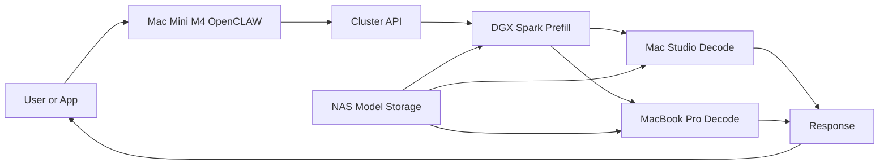

# LOCALSONLY — EXO inference cluster: cost and WHY

**TL;DR:** The EXO Inference Cluster runs inference locally: prefill on a DGX Spark, decode on Mac Studio and MacBook Pro, with models on NAS, all orchestrated by a Mac Mini M4 running OpenCLAW. You get low-latency, private, controllable inference with no third-party API rate limits; cost is front-loaded (hardware) instead of ongoing cloud API spend.

**Contents:** [Architecture](#architecture) · [exo (local AI cluster)](#exo-local-ai-cluster) · [Use cases](#use-cases) · [WHY this setup](#why-this-setup) · [Cost](#cost) · [Caveats: mistakes in local vs API comparisons](#caveats-mistakes-in-local-vs-api-comparisons) · [Relation to VINCE](#relation-to-vince) · [Links](#links)

---

## Architecture

The setup has two parts: the **EXO Inference Cluster** (compute and storage) and a **low-power orchestrator** (Mac Mini M4) that talks to the cluster via API.

### EXO Inference Cluster

| Component | Role | Specs |
|-----------|------|--------|
| **DGX SPARK** | Prefill | 128GB memory, ~100 TFLOPs |
| **MAC STUDIO** | Decode | 512GB memory, 819 GB/s bandwidth |
| **MACBOOK PRO** | Decode | 128GB memory, 400 GB/s bandwidth |
| **NAS** | Model storage | Network-attached; shared model store |
| **10GbE Switch** | Network | Connects all nodes (Mac Studio 10GbE; MacBook Pro WiFi/10GbE) |

**Cluster totals:** 768GB memory, ~140 TFLOPs, ~1.5 TB/s bandwidth.

### Orchestrator

| Component | Role | Specs |
|-----------|------|--------|
| **Mac Mini M4** | Orchestrator | 16GB RAM, ~5W; runs OpenCLAW; connects to cluster via API |

### Data flow

---

## exo (local AI cluster)

**[exo](https://github.com/exo-explore/exo)** (exo-explore/exo) is open-source software to run frontier AI locally. It fits the EXO cluster and Mac Mini orchestrator setup.

- **What it does:** Connects all your devices into one AI cluster. Lets you run models larger than a single device can hold; with RDMA over Thunderbolt 5, adding more devices can make inference faster.
- **Features:** Automatic device discovery (no manual config), RDMA over Thunderbolt (day-0 support, large latency reduction between devices), topology-aware auto parallel (splits the model across devices using resources and link latency/bandwidth), tensor parallelism (e.g. up to ~1.8x on 2 devices, ~3.2x on 4), MLX as inference backend and MLX distributed for communication.
- **Dashboard & API:** Each device exposes an API and a dashboard; default is `http://localhost:52415`. Compatible with OpenAI-style `/v1/chat/completions` for chat.
- **Platforms:** macOS (GPU via MLX; RDMA on macOS 26.2+ with Thunderbolt 5). Linux (CPU for now; GPU in development).
- **Docs:** [README](https://github.com/exo-explore/exo), [API basics](https://github.com/exo-explore/exo/blob/main/docs/api.md), [API types](https://github.com/exo-explore/exo/tree/main/src/exo/master). Quick start: clone, build dashboard (`dashboard && npm install && npm run build`), run `uv run exo`.

Use exo on the cluster nodes (e.g. Mac Studio, MacBook Pro) for distributed inference; the Mac Mini can run as coordinator-only (`uv run exo --no-worker`) for orchestration without running inference.

---

## Use cases

### Exported conversations → one self-hosted agent (Mac Mini)

Export your conversations from ChatGPT and Claude, merge them into a single self-hosted agent running on a Mac Mini (or the cluster). **You own the data. You control the model. It evolves with you.** No vendor lock-in; fine-tune or prompt from your own history on your own hardware.

### VINCE repo agents ([src/agents/](src/agents/)) on the same cluster

Run **VINCE** (unified data intel, paper bot, options/perps/memes), **Kelly** (lifestyle concierge, hotels & fine dining), **Solus** (wealth architect, HYPERSURFACE options), and other [src/agents/](src/agents/) characters against the same local inference cluster. One inference budget, one place for models and data; each agent keeps its role and knowledge. Options:

- Route all agents to the cluster to eliminate or cap API spend (see [TREASURY.md](TREASURY.md)).
- Put heavier reasoning (e.g. Solus, VINCE) on the cluster and lighter or latency-sensitive flows on the Mac Mini.
- Share the same local stack so context (e.g. knowledge, memory) can stay on-prem while each agent stays specialized (trading vs lifestyle vs wealth).

---

## WHY this setup

| Dimension | Rationale |
|-----------|-----------|
| **Performance & control** | Predictable latency, no rate limits; you tune models and batch sizes locally. |
| **Operational cost** | After CapEx, marginal cost is power and cooling; at high sustained volume this can undercut cloud API spend—compare at your usage. |
| **Privacy & security** | Data and models stay on-prem; no egress to third-party inference APIs. |
| **Specialized roles** | Prefill on DGX Spark and decode on Apple Silicon matches common LLM serving patterns and uses each machine’s strengths. |
| **Low-power orchestration** | Mac Mini M4 (~5W) as the control plane keeps idle and management cost low. |

**When it makes sense:** High sustained inference volume, compliance or privacy requirements, or a preference for upfront CapEx over recurring API bills. **When cloud may still win:** Very spiky or low volume, or when you want zero infra to operate.

---

## Cost

### CapEx (one-time)

| Component | Role | Order of magnitude / notes |
|-----------|------|----------------------------|
| DGX Spark | Prefill | TBD — check current NVIDIA pricing |
| Mac Studio | Decode | TBD — high-memory config |
| MacBook Pro | Decode | TBD — high-memory config |
| NAS | Model storage | TBD — capacity and speed to suit model set |
| 10GbE switch + cabling/NICs | Network | TBD — switch + NICs per machine |

**Note:** Total upfront is significant compared to $0 for API-only; the tradeoff is lower marginal cost at scale.

### OpEx (ongoing)

- **Power:** Dominated by DGX Spark, Mac Studio, and MacBook Pro when under load; Mac Mini is negligible (~5W).
- **Cooling:** Matters if the cluster lives in a confined or warm space.
- **Maintenance:** Plan for drives, dust, and occasional failures; no formal line-item here, but budget time or contingency.

### Optional

- **Software:** None if you use an open-source stack (e.g. OpenCLAW and open model runtimes).
- **Network:** 10GbE is covered in CapEx; no recurring cost unless you add hosted VPN or peering.

### Model at ~2B tokens/month

Your recent usage is on the order of **~1.9B tokens/month** (e.g. Jan 25–Feb 25 window), with an equivalent cost of **~$932/month** (Claude 4.5 Opus high-thinking + Auto; “Included” in Ultra here, but we use it as the cost to beat). That’s **~$11.2k/year** if paid as inference.

| Item | Tokens | Cost (equiv.) |
|------|--------|----------------|
| claude-4.5-opus-high-thinking | 531.9M | $501 |
| Auto | 1.4B | $431 |
| **Total** | **~1.9B** | **~$932/mo** |

To model the EXO cluster against that:

1. **CapEx (ballpark for substitution):** DGX Spark ~$15k–30k, Mac Studio 512GB ~$4k–8k, MacBook Pro 128GB ~$3k–5k, NAS ~$0.5k–2k, 10GbE switch + NICs ~$0.5k–1k → **total ~$25k–50k**. Replace with your actual quotes.
2. **OpEx:** Cluster (DGX + Mac Studio + MacBook Pro) under load can be ~600–1000W. At $0.12–0.15/kWh, 24/7 → **~$65–150/month** power; add something for cooling if needed (e.g. +20%). Mac Mini orchestrator (~5W) is negligible.
3. **Amortization:** Spread CapEx over 24, 36, or 48 months. Example: **$35k CapEx over 36 months** → **~$972/mo**; **OpEx ~$120/mo** → **total ~$1,092/mo**. That’s about **$160/mo more** than the $932 cloud equivalent in this example. At **48 months** same CapEx: **~$729 + $120 ≈ $849/mo** → **below** $932. At **lower CapEx** (e.g. $28k) over 36 mo: **~$778 + $120 ≈ $898/mo** → close to or below cloud.

**Takeaway:** At ~2B tokens/month, local can undercut the equivalent cloud cost if (a) you amortize over 3–4 years and (b) your all-in CapEx stays in the lower part of the range (or you already own some hardware). At 2-year amortization or high CapEx, cloud may still be cheaper on a pure $ basis; privacy, control, and no rate limits are the other levers for going local.

### Vs cloud (generic)

At any volume (e.g. X tokens/month or Y requests/day), compare estimated cloud inference spend to **(OpEx + amortized CapEx)**. Local cluster becomes attractive when that total is lower than projected API bills. See [TREASURY.md](TREASURY.md) Strategy 4 (cost optimization) for the broader cost mandate.

---

## Caveats: mistakes in local vs API comparisons

Many “local vs API” analyses understate the benefit of local (e.g. M3 Ultra Mac Studio) by making one or more of these mistakes. Correcting them can shift monthly savings into the **$150–$3k+** range depending on volume and provider.

| Mistake | What’s wrong | Correction |
|--------|---------------|------------|
| **1. $/tok from single-request TPS** | Cost per token is often computed from single-request throughput. LLM inference can be **batched**; you move along a pareto frontier of throughput vs single-request latency. The right point depends on SLOs and workload, not “min throughput.” | Use throughput-appropriate batching. Savings vs naive single-request math can be **2×–20×** (e.g. $156–$1,560/mo at $1.50/M, or $312–$3,120/mo at $3/M official API). |
| **2. Device obsolete in 12 months** | Treating Mac Studio (or similar) as worthless after a year. | Macs retain value well; resale typically depreciates **~15%/year**, and the machine is useful for far more than AI (dev, media, etc.). |
| **3. Cherry-picked / cheap API provider** | Basing comparison on a discount provider (e.g. OpenRouter) with e.g. 98.4% uptime (~11.5 h/month down). | Compare to **official** API pricing (e.g. Kimi K2.5 at **$3/M output** tokens) for a fair like-for-like. |
| **4. Ignoring input tokens and context** | Only counting output token cost. Official APIs charge for **input** too (e.g. $0.60/M input; $0.10/M cache hit). Your context is unique—providers can’t scale it like shared weights, so they charge. | Large context (e.g. 200K-token codebase) = **$0.12** per full load, **$0.02** per cached query. Tool-augmented flows (Claude Code, OpenCode, etc.) add many requests; input + cache cost adds up fast. Local keeps context hot at no per-request cost. |
| **5. Only comparing cost** | Framing local vs API as purely $/token. | Other reasons to run local (often **more important**): **privacy**, **compliance**, **sovereignty** (your weights, your brain), **uptime guarantees**, **air gapping**, **no internet**. Latency can favor cloud unless you need one of these (e.g. air gap). |

*Context: critique of analyses that called $20k/mo API spend “aggressive” but then lowballed local savings; open benchmarks/evals for 1,000+ local setups are in the works.*

---

## Relation to VINCE

- **TREASURY:** Running inference locally is a form of cost optimization—it reduces or eliminates inference API burn for heavy workloads. See [TREASURY.md](TREASURY.md).
- **Use case:** Point VINCE (or other inference-heavy agents) at this cluster to cap or remove inference API costs; the orchestrator can route requests to local inference when the cluster is available.

---

## Links

| What | URL / doc |
|------|-----------|
| **exo** | [github.com/exo-explore/exo](https://github.com/exo-explore/exo) — run frontier AI locally, cluster devices, MLX, RDMA over Thunderbolt; dashboard at `localhost:52415` |
| exo API | [docs/api.md](https://github.com/exo-explore/exo/blob/main/docs/api.md), [src/exo/master/api.py](https://github.com/exo-explore/exo/tree/main/src/exo/master) |
| OpenCLAW | (Add orchestrator / OpenCLAW repo link when available) |
| TREASURY | [TREASURY.md](TREASURY.md) — cost coverage, profitability |
| README | [README.md](../../README.md) — project overview |
| CLAUDE | [CLAUDE.md](../../CLAUDE.md) — dev guide |
| Agents | [src/agents/](../src/agents/) — VINCE, Kelly, Solus, Otaku, Eliza |

---

*Last updated: 2026-02-13. Cost model for ~2B tokens/month; added caveats (five common mistakes in local vs API comparisons).*
