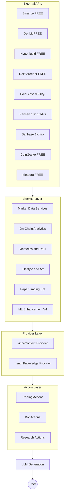

# plugin-vince Development Guide for Claude

```
  ██╗   ██╗██╗███╗   ██╗ ██████╗███████╗
  ██║   ██║██║████╗  ██║██╔════╝██╔════╝
  ██║   ██║██║██╔██╗ ██║██║     █████╗  
  ╚██╗ ██╔╝██║██║╚██╗██║██║     ██╔══╝  
   ╚████╔╝ ██║██║ ╚████║╚██████╗███████╗
    ╚═══╝  ╚═╝╚═╝  ╚═══╝ ╚═════╝╚══════╝
```

> **Optimized for Claude LLM** - Complete reference for working with the VINCE trading plugin

"VINCE is a quantitative trading assistant with a lifestyle overlay—balancing market analysis with day-of-week aware suggestions for dining, hotels, and activities."

## Plugin Overview

| Property | Value |
| --- | --- |
| **Plugin Name** | `@elizaos/plugin-vince` |
| **Purpose** | Unified data intelligence for trading, options, perps, memes, and lifestyle |
| **Services** | 30 services across 7 categories |
| **Actions** | 20 user-facing actions |
| **Providers** | 2 context providers |
| **Evaluators** | 1 trade performance evaluator |
| **Focus Areas** | OPTIONS, PERPS, HIP-3, MEMETICS, LIFESTYLE, ART |
| **Core Assets** | BTC, ETH, SOL, HYPE + 34 HIP-3 assets |

## Storage, feature store & deployment

- **Feature store (ML training data):** Records are written to (1) local JSONL `.elizadb/vince-paper-bot/features/*.jsonl`, (2) table `plugin_vince.paper_bot_features` when the app has a DB (PGLite or Postgres), (3) optional Supabase table `vince_paper_bot_features` when `SUPABASE_SERVICE_ROLE_KEY` is set. See **FEATURE-STORE.md** (repo root) for how this fits with ElizaOS auto-generated tables (agents, memories, entities, rooms): we use a **separate plugin schema/table**, not core ElizaOS tables, for feature rows.
- **Signal sources:** 10+ sources feed the aggregator (CoinGlass, Binance, MarketRegime, News, Deribit, liquidations, Sanbase, Hyperliquid, etc.). Confirm which contribute in logs: startup `[VINCE] 📡 Signal sources available:`; per aggregation `[VinceSignalAggregator] ASSET: N source(s) → M factors | Sources: ...`. See **SIGNAL_SOURCES.md** to enable or fix sources; priority is to leverage more real-time data for the paper trading algo.
- **Current deploy:** Prod on Eliza Cloud works; still **PGLite** (no Supabase Postgres yet). Next: migrate to Supabase Postgres so `plugin_vince.paper_bot_features` lives in the same DB as ElizaOS tables.

## Architecture



## File Structure

```
plugin-vince/
├── src/
│   ├── index.ts                 # Plugin definition, exports, init
│   ├── actions/                 # 20 user-facing actions
│   │   ├── gm.action.ts
│   │   ├── options.action.ts
│   │   ├── perps.action.ts
│   │   ├── memes.action.ts
│   │   ├── bot.action.ts
│   │   └── ... (15 more)
│   ├── services/                # 30 data services
│   │   ├── binance.service.ts
│   │   ├── signalAggregator.service.ts
│   │   ├── vincePaperTrading.service.ts
│   │   ├── vinceFeatureStore.service.ts   # ML V4
│   │   ├── weightBandit.service.ts        # ML V4
│   │   ├── fallbacks/           # Built-in API fallbacks
│   │   │   ├── deribit.fallback.ts
│   │   │   ├── hyperliquid.fallback.ts
│   │   │   └── index.ts
│   │   └── ... (more services)
│   ├── providers/               # 2 context providers
│   │   ├── vinceContext.provider.ts
│   │   └── trenchKnowledge.provider.ts
│   ├── evaluators/              # Self-improving evaluators
│   │   └── tradePerformance.evaluator.ts
│   ├── tasks/                   # Scheduled tasks
│   │   └── grokExpert.tasks.ts
│   ├── analysis/                # Analysis engines
│   │   └── bullBearAnalyzer.ts
│   ├── utils/                   # Shared utilities
│   │   ├── sessionFilters.ts
│   │   └── tradeExplainer.ts
│   ├── constants/               # Configuration constants
│   │   ├── targetAssets.ts
│   │   ├── memes.constants.ts
│   │   └── paperTradingDefaults.ts
│   ├── types/                   # TypeScript definitions
│   │   ├── index.ts
│   │   ├── analysis.ts
│   │   ├── paperTrading.ts
│   │   └── external-services.ts
│   └── __tests__/               # Test suite
│       ├── actions/
│       ├── standalone.test.ts
│       └── realData.e2e.test.ts
├── scripts/
│   └── train_models.py          # XGBoost to ONNX training
├── package.json
├── vitest.config.ts
├── README.md
├── WHAT.md                      # Purpose and philosophy
└── WHY.md                       # Framework decision context
```

## Service Categories

### Market Data Services (10)

| Service | Purpose | API | Cost |
| --- | --- | --- | --- |
| `VinceBinanceService` | Top traders, taker flow, OI, funding | Binance Futures | FREE |
| `VinceBinanceLiquidationService` | Real-time liquidation WebSocket | Binance WS | FREE |
| `VinceCoinGlassService` | Funding, L/S ratio, Fear/Greed | CoinGlass | $350/yr |
| `VinceCoinGeckoService` | Prices, exchange health | CoinGecko | FREE |
| `VinceDeribitService` | IV surface, Greeks, DVOL | Deribit | FREE |
| `VinceHIP3Service` | HIP-3 asset prices, funding | Hyperliquid | FREE |
| `VinceMarketDataService` | Aggregated context (RSI, volatility) | Internal | - |
| `VinceMarketRegimeService` | Regime detection (trending/ranging) | Internal | - |
| `VinceSignalAggregatorService` | Weighted signal voting with ML | Internal | - |
| `VinceTopTradersService` | Whale wallet tracking | Hyperliquid, Birdeye | FREE |

### On-Chain Analytics (3)

| Service | Purpose | API | Cost |
| --- | --- | --- | --- |
| `VinceNansenService` | Smart money flows | Nansen | 100 credits/mo |
| `VinceSanbaseService` | Network activity, whale flows | Santiment | 1K calls/mo |
| `VinceNewsSentimentService` | MandoMinutes sentiment | Browser scraping | FREE |

### Memetics and DeFi (3)

| Service | Purpose | API | Cost |
| --- | --- | --- | --- |
| `VinceDexScreenerService` | Meme scanner, traction analysis | DexScreener | FREE |
| `VinceMeteoraService` | LP pool discovery for DCA | Meteora | FREE |
| `VinceWatchlistService` | Token watchlist management | Internal | - |

### Lifestyle and Art (2)

| Service | Purpose | API | Cost |
| --- | --- | --- | --- |
| `VinceLifestyleService` | Day-of-week suggestions | Internal | - |
| `VinceNFTFloorService` | Floor tracking, thickness analysis | OpenSea | FREE |

### Paper Trading Bot (6)

| Service | Purpose |
| --- | --- |
| `VincePaperTradingService` | Main orchestration, order simulation, ML integration |
| `VincePositionManagerService` | Position tracking, P&L updates |
| `VinceRiskManagerService` | Circuit breakers, session filters |
| `VinceTradeJournalService` | Trade history, signal performance |
| `VinceGoalTrackerService` | KPI tracking ($420/day, $10K/month) |
| `VinceAlertService` | Multi-source alert detection |

### ML Enhancement Services (4) - V4

| Service | Purpose | Algorithm |
| --- | --- | --- |
| `VinceFeatureStoreService` | Collect 40+ features per trade decision | JSONL persistence |
| `VinceWeightBanditService` | Adaptive signal source weights | Thompson Sampling |
| `VinceSignalSimilarityService` | Historical trade similarity lookup | Embedding k-NN |
| `VinceMLInferenceService` | ONNX model loading and inference | Signal quality, sizing |

### Self-Improving Architecture (2)

| Service | Purpose |
| --- | --- |
| `VinceParameterTunerService` | Bayesian optimization for thresholds |
| `VinceImprovementJournalService` | Structured improvement suggestions |

## Action Categories

### Core Trading Actions

| Action | Triggers | Description |
| --- | --- | --- |
| `VINCE_GM` | "gm", "good morning", "briefing" | Morning briefing across all domains |
| `VINCE_OPTIONS` | "options", "strike", "covered call" | HYPERSURFACE analysis for weekly options |
| `VINCE_PERPS` | "perps", "trading", "signal" | Perpetual trading signals with narrative |
| `VINCE_HIP3` | "hip3", "stocks", "gold", "nvda" | HIP-3 asset analysis |
| `VINCE_INTEL` | "intel", "whales", "liquidations" | Binance market intelligence |
| `VINCE_NEWS` | "news", "mando", "headlines" | News sentiment analysis |

### Memetics and Airdrops

| Action | Triggers | Description |
| --- | --- | --- |
| `VINCE_MEMES` | "memes", "trenches", "ai token" | Hot meme scanner with traction analysis |
| `VINCE_MEME_DEEP_DIVE` | "deep dive $TOKEN", "dd $TOKEN" | Detailed analysis of specific meme |
| `VINCE_AIRDROPS` | "airdrops", "farming", "treadfi" | Airdrop strategy guidance |

### Paper Trading Bot

| Action | Triggers | Description |
| --- | --- | --- |
| `VINCE_BOT_TRADE` | "trade", "execute", "go long/short" | Evaluate and trigger paper trade |
| `VINCE_BOT_STATUS` | "bot status", "portfolio" | Portfolio and position status |
| `VINCE_BOT_PAUSE` | "pause bot", "resume bot" | Pause/resume trading |
| `VINCE_WHY_TRADE` | "why", "explain", "reasoning" | Explain trading decisions |

### Lifestyle and Art

| Action | Triggers | Description |
| --- | --- | --- |
| `VINCE_LIFESTYLE` | "lifestyle", "dining", "hotel" | Day-of-week aware suggestions |
| `VINCE_NFT_FLOOR` | "nft", "floor", "punk" | Thin floor buying opportunities |

### Knowledge and Research

| Action | Triggers | Description |
| --- | --- | --- |
| `VINCE_UPLOAD` | "upload:", "save this:", URLs | Knowledge ingestion |
| `VINCE_GROK_EXPERT` | "grok pulse", "prompt of the day" | Daily research suggestions |
| `VINCE_WATCHLIST` | "watchlist", "watch $TOKEN" | Manage token watchlist |
| `VINCE_ALERTS` | "alerts", "notifications" | View and manage alerts |

## Key Technical Patterns

### 1. Fallback Service System

External plugins are preferred, but built-in API fallbacks ensure functionality:

```typescript
// From src/services/fallbacks/index.ts
const deribitService = runtime.getService("deribit");
if (!deribitService) {
  // Use built-in VinceDeribitService (direct API calls)
}
```

**Fallback Coverage:**
- Deribit → Built-in API client
- Hyperliquid → Built-in API client
- OpenSea → Built-in API client
- XAI (Grok) → Built-in API client
- Browser → Built-in fetch

### 2. Circuit Breaker Pattern

Services implement exponential backoff and circuit breakers:

```typescript
const CIRCUIT_BREAKER = {
  maxFailures: 3,
  resetTimeMs: 60000,
  backoffMs: [1000, 2000, 4000]
};
```

### 3. Session-Based Trading Filters

From `utils/sessionFilters.ts`:

| Session | Hours (UTC) | Confidence | Size |
| --- | --- | --- | --- |
| Asia | 00:00-07:00 | 0.9x | 0.8x |
| Europe | 07:00-13:00 | 1.0x | 1.0x |
| EU/US Overlap | 13:00-16:00 | 1.1x | 1.1x |
| US | 16:00-22:00 | 1.0x | 1.0x |
| Off-Hours | 22:00-00:00 | 0.8x | 0.7x |

Weekend trading applies additional 0.8x confidence multiplier.

### 4. Signal Aggregation Weights

From `constants/paperTradingDefaults.ts`:

| Source | Weight | Rationale |
| --- | --- | --- |
| Top Traders | 40 | Primary signal from whale activity |
| Market Data | 20 | Funding, OI, L/S ratio |
| Technical | 15 | RSI, SMA, price action |
| Sentiment | 10 | Fear/greed index |
| News | 10 | MandoMinutes sentiment |
| On-Chain | 5 | Nansen, Sanbase data |

Historical performance adjusts weights via Thompson Sampling.

### 5. Goal-Aware Trading (Kelly Criterion)

From `services/goalTracker.service.ts`:

```typescript
const TRADING_GOALS = {
  dailyTarget: 420,      // $420/day
  monthlyTarget: 10000,  // $10K/month
  maxDailyLoss: 200,     // Stop trading after $200 loss
  maxDrawdown: 0.15      // 15% portfolio drawdown circuit breaker
};
```

## V4 ML Enhancement Architecture

### Three Learning Layers

**Layer 1: Online Learning (Immediate Adaptation)**

| Component | Algorithm | Persistence |
| --- | --- | --- |
| Weight Bandit | Thompson Sampling | `weight-bandit-state.json` |
| Signal Similarity | Embedding k-NN | `signal-similarity-state.json` |
| Parameter Tuner | Bayesian Optimization | `bayesian-tuner-state.json` |

**Layer 2: Feature Collection (Training Data)**

The Feature Store captures 40+ features per trading decision:

| Category | Features |
| --- | --- |
| Market | Price, 1h/4h/24h changes, volume, ATR, RSI |
| Session | Current session, overlap flag, weekend flag |
| Signal | Strength, confidence, confirming count, source breakdown |
| Regime | Trend direction, strength, volatility quantile |
| News | Headline sentiment, impact score |
| Execution | Fill price, slippage, leverage, streak multiplier |
| Outcome | P&L, R-multiple, MAE, MFE, duration, exit reason |

**Layer 3: Offline Training (ONNX Inference)**

| Model | Type | Use Case |
| --- | --- | --- |
| Signal Quality | Binary Classification | Filter low-quality signals |
| Position Sizing | Regression | Dynamic position sizing |
| TP Optimizer | Multi-class | Optimize take-profit levels |
| SL Optimizer | Quantile Regression | ATR-calibrated stop losses |

### Graceful Degradation

Every ML component has a fallback path:

| Component | If Available | Fallback |
| --- | --- | --- |
| Weight Bandit | Sample from Beta distributions | Static weights from `dynamicConfig` |
| Signal Similarity | k-NN on embeddings | Return neutral recommendation |
| ML Inference | ONNX model prediction | Rule-based signal filtering |
| Parameter Tuner | Bayesian proposal | Rule-based threshold adjustment |

**Timeline:**
- Day 1: Bot works with rule-based logic (V3 behavior)
- Day 30: Online learning kicks in (Thompson Sampling, Similarity)
- Day 90+: Enough data to train offline models (ONNX inference)

## Testing

### Commands

```bash
# Run all tests
bun run test

# Run unit tests only
bun run test:unit

# Run E2E tests with real API calls
bun run test:e2e

# Watch mode
bun run test:watch
```

### Test File Locations

| Type | Location | Description |
| --- | --- | --- |
| Unit Tests | `src/__tests__/*.test.ts` | Component tests with mocks |
| Action Tests | `src/__tests__/actions/*.test.ts` | Action handler tests |
| E2E Tests | `src/__tests__/*.e2e.test.ts` | Real API integration tests |
| Test Utilities | `src/__tests__/test-utils.ts` | Mock factories and helpers |

### Testing Patterns

```typescript
// Use test-utils.ts for mocking runtime
import { createMockRuntime, createMockMessage } from "./test-utils";

describe("vincePerpsAction", () => {
  it("should generate trading signal", async () => {
    const runtime = createMockRuntime();
    const message = createMockMessage("perps BTC");
    
    const result = await vincePerpsAction.handler(runtime, message);
    expect(result.success).toBe(true);
  });
});
```

## Environment Configuration

### Environment Variables

All environment variables are **optional** - the plugin works with free APIs by default.

```bash
# CoinGlass - Enhanced market data
# Hobbyist: $29/mo, Startup: $79/mo (adds Hyperliquid whale data)
COINGLASS_API_KEY=your_key_here

# Nansen - Smart money flows (100 credits/month free)
NANSEN_API_KEY=your_key_here

# Sanbase/Santiment - On-chain analytics
# WARNING: Free tier has 30-day lag on whale metrics
SANBASE_API_KEY=your_key_here

# Birdeye - Solana wallet tracking
BIRDEYE_API_KEY=your_key_here

# XAI - Grok Expert daily pulse feature
XAI_API_KEY=your_key_here
```

### Character Configuration

Add the plugin to your character's plugins array:

```json
{
  "name": "VINCE",
  "plugins": ["@elizaos/plugin-vince"],
  "settings": {
    "secrets": {
      "COINGLASS_API_KEY": "optional_key",
      "NANSEN_API_KEY": "optional_key"
    }
  }
}
```

## Data Persistence

All persistent data is stored in `.elizadb/vince-paper-bot/`:

| File | Purpose |
| --- | --- |
| `features/*.jsonl` | Feature store for ML training |
| `weight-bandit-state.json` | Thompson Sampling win/loss counts |
| `signal-similarity-state.json` | Embedded trade contexts |
| `bayesian-tuner-state.json` | Parameter optimization history |
| `improvement-journal.md` | Structured improvement suggestions |
| `portfolio.json` | Paper trading portfolio state |
| `positions.json` | Open position tracking |
| `journal.json` | Trade history |
| `risk-state.json` | Circuit breaker state |
| `goal-tracker.json` | Daily/monthly KPI tracking |
| `tuned-config.json` | Dynamically tuned parameters |

### Inspecting State

```bash
# Feature store record count
cat .elizadb/vince-paper-bot/features/*.jsonl | wc -l

# Bandit win/loss per source
cat .elizadb/vince-paper-bot/weight-bandit-state.json | jq '.sources'

# Best parameter set from tuner
cat .elizadb/vince-paper-bot/bayesian-tuner-state.json | jq '.bestObservation'
```

## Key Configuration Constants

### Paper Trading Defaults

From `src/constants/paperTradingDefaults.ts`:

```typescript
// Trading goals
const DEFAULT_TRADING_GOAL = {
  dailyTarget: 420,        // $420/day target
  monthlyTarget: 10_000,   // $10K/month
  riskPerTradePct: 1.5,    // 1.5% risk per trade
  maxDailyDrawdownPct: 5,  // Stop at 5% daily loss
  targetWinRate: 55,       // 55% win rate target
  targetRiskReward: 1.5,   // 1.5:1 R:R ratio
};

// Risk limits
const DEFAULT_RISK_LIMITS = {
  maxPositionSizePct: 10,     // Max 10% per position
  maxTotalExposurePct: 30,    // Max 30% total exposure
  maxLeverage: 5,             // Max 5x leverage
  minSignalStrength: 70,      // Minimum signal strength
  minSignalConfidence: 65,    // Minimum confidence
  minConfirmingSignals: 3,    // Need 3 confirming signals
};

// Signal thresholds
const SIGNAL_THRESHOLDS = {
  MIN_STRENGTH: 70,
  MIN_CONFIDENCE: 65,
  MIN_CONFIRMING: 3,
  STRONG_STRENGTH: 80,
  HIGH_CONFIDENCE: 80,
};
```

### Target Assets

From `src/constants/targetAssets.ts`:

**Primary Trading Assets:** BTC, ETH, SOL, HYPE

**HIP-3 Assets (34 total):**
- Commodities: GOLD, SILVER, OIL
- Indices: SPX, NDX, DJI
- Stocks: NVDA, AAPL, TSLA, MSFT, GOOGL, AMZN, META
- AI/Tech: Various sector leaders

## Development Workflow

### Adding a New Action

1. Create action file in `src/actions/`:

```typescript
// src/actions/newFeature.action.ts
import type { Action, IAgentRuntime, Memory, State } from "@elizaos/core";

export const vinceNewFeatureAction: Action = {
  name: "VINCE_NEW_FEATURE",
  description: "Description of what this action does",
  similes: ["new feature", "feature", "trigger words"],
  
  validate: async (runtime: IAgentRuntime, message: Memory) => {
    const text = message.content.text?.toLowerCase() || "";
    return text.includes("new feature");
  },
  
  handler: async (runtime, message, state, options, callback) => {
    // Get required services
    const marketData = runtime.getService("vince-market-data");
    
    // Generate response
    const response = "Your response here";
    
    await callback({ text: response });
    return { success: true };
  },
  
  examples: [
    [
      { name: "user", content: { text: "new feature" } },
      { name: "VINCE", content: { text: "Feature response" } },
    ],
  ],
};
```

2. Register in `src/index.ts`:

```typescript
import { vinceNewFeatureAction } from "./actions/newFeature.action";

export const vincePlugin: Plugin = {
  // ...
  actions: [
    // ... existing actions
    vinceNewFeatureAction,
  ],
};
```

3. Add tests in `src/__tests__/actions/`:

```typescript
// src/__tests__/actions/newFeature.actions.test.ts
import { describe, it, expect } from "vitest";
import { vinceNewFeatureAction } from "../../actions/newFeature.action";
import { createMockRuntime, createMockMessage } from "../test-utils";

describe("vinceNewFeatureAction", () => {
  it("should validate correctly", async () => {
    const runtime = createMockRuntime();
    const message = createMockMessage("new feature");
    
    const valid = await vinceNewFeatureAction.validate(runtime, message);
    expect(valid).toBe(true);
  });
});
```

### Adding a New Service

1. Create service file in `src/services/`:

```typescript
// src/services/newData.service.ts
import { Service, IAgentRuntime, logger } from "@elizaos/core";

export class VinceNewDataService extends Service {
  static serviceType = "vince-new-data";
  
  private cache: Map<string, any> = new Map();
  private cacheTTL = 5 * 60 * 1000; // 5 minutes
  
  constructor(protected runtime: IAgentRuntime) {
    super();
  }
  
  static async start(runtime: IAgentRuntime): Promise<VinceNewDataService> {
    const service = new VinceNewDataService(runtime);
    logger.info("[VinceNewDataService] Started");
    return service;
  }
  
  async stop(): Promise<void> {
    this.cache.clear();
    logger.info("[VinceNewDataService] Stopped");
  }
  
  async getData(): Promise<any> {
    // Implementation with caching
    const cacheKey = "data";
    const cached = this.cache.get(cacheKey);
    if (cached && Date.now() - cached.timestamp < this.cacheTTL) {
      return cached.data;
    }
    
    // Fetch fresh data
    const data = await this.fetchData();
    this.cache.set(cacheKey, { data, timestamp: Date.now() });
    return data;
  }
  
  private async fetchData(): Promise<any> {
    // API call implementation
  }
}
```

2. Register in `src/index.ts`:

```typescript
import { VinceNewDataService } from "./services/newData.service";

export const vincePlugin: Plugin = {
  // ...
  services: [
    // ... existing services
    VinceNewDataService,
  ],
};
```

## Common Debugging

### Check Fallback Service Usage

During plugin initialization, the console shows which services use external plugins vs built-in fallbacks:

```
[VINCE] ✅ Using external plugins: Deribit (DVOL, P/C ratio), Hyperliquid (funding)
[VINCE] 🔄 Using built-in API fallbacks: OpenSea, XAI
[VINCE] ⚠️ XAI not configured (add XAI_API_KEY for Grok Expert)
```

### Monitor ML Component Status

```bash
# Check Thompson Sampling state
cat .elizadb/vince-paper-bot/weight-bandit-state.json | jq '.'

# Check feature collection count
wc -l .elizadb/vince-paper-bot/features/*.jsonl

# Check improvement suggestions
cat .elizadb/vince-paper-bot/improvement-journal.md
```

### Inspect Signal Aggregation

Enable debug logging to see signal aggregation details:

```bash
LOG_LEVEL=debug elizaos start
```

Look for log lines like:
```
[SignalAggregator] BTC signal: strength=72, confidence=68, sources=["funding", "liquidation", "whale"]
[SignalAggregator] Session adjustment: EU/US Overlap (1.1x confidence)
[SignalAggregator] ML quality score: 0.78 (proceed)
```

## Whale Signal Status (Feb 2026)

Important: 2 of 3 whale sources were found to provide stale or fake data:

| Source | Weight | Status | Notes |
| --- | --- | --- | --- |
| TopTraders | 0.0 (disabled) | No data | Requires manual wallet addresses in `wallets.json` |
| SanbaseWhales | 0.0 (disabled) | 30-day lag | Santiment free tier has 30-day delay |
| BinanceTopTraders | 1.0 | Working | Only real whale data currently active |

**Upgrade Path:** CoinGlass Startup tier ($79/mo) adds Hyperliquid whale alerts.

## Related Documentation

- [README.md](README.md) - Full plugin documentation
- [WHAT.md](WHAT.md) - Purpose and philosophy
- [WHY.md](WHY.md) - Framework decision context (ElizaOS vs ClawdBot)
- [../../../CLAUDE.md](../../../CLAUDE.md) - Main project development guide
