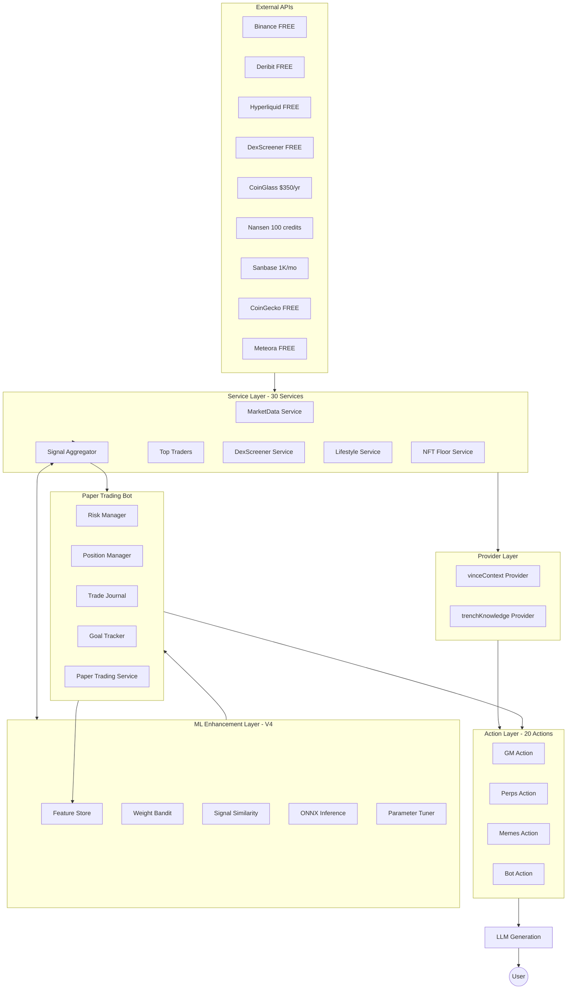
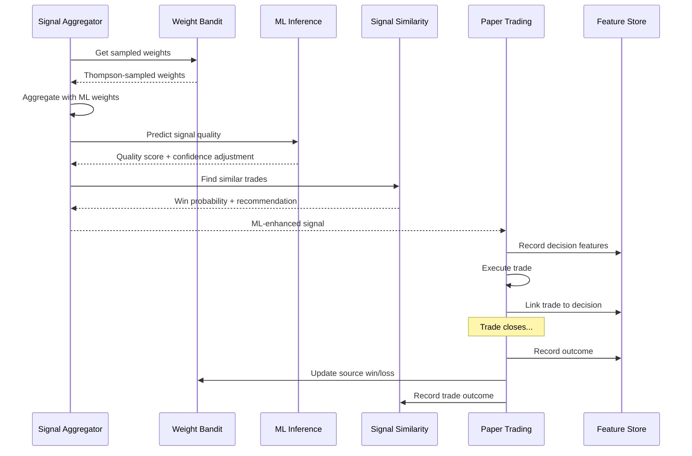

# plugin-vince

```
  ██╗   ██╗██╗███╗   ██╗ ██████╗███████╗
  ██║   ██║██║████╗  ██║██╔════╝██╔════╝
  ██║   ██║██║██╔██╗ ██║██║     █████╗  
  ╚██╗ ██╔╝██║██║╚██╗██║██║     ██╔══╝  
   ╚████╔╝ ██║██║ ╚████║╚██████╗███████╗
    ╚═══╝  ╚═╝╚═╝  ╚═══╝ ╚═════╝╚══════╝
```

**Unified Data Intelligence for the VINCE Agent**

> A comprehensive ElizaOS plugin that consolidates trading, memetics, lifestyle, and art data sources into a single coherent system. **At its core: an ML-driven paper trading bot** that uses ONNX models (signal quality, position sizing, TP/SL) and a training-produced improvement report to block low-quality trades, size positions, and set take-profit/stop-loss from data—so the bot improves as it trades. VINCE also operates as a quantitative trading assistant with a lifestyle overlay: market analysis plus day-of-week aware suggestions for dining, hotels, and activities.

---

```
┌─────────────────────────────────────────────────────────┐
│  📑 TABLE OF CONTENTS                                    │
└─────────────────────────────────────────────────────────┘
```

## Table of Contents

- [Heart of VINCE: Signals → Trades → Learning](#heart-of-vince-signals--trades--learning)
- [WHAT - The Plugin's Purpose](#what---the-plugins-purpose)
- [HOW - Architecture and Implementation](#how---architecture-and-implementation)
- [V4 - ML-Enhanced Paper Trading](#v4---ml-enhanced-paper-trading)
- [How ML improves the algo (in plain language)](#how-ml-improves-the-algo-in-plain-language)
- [ML at the Core: What’s Wired in Every Trade](#ml-at-the-core-whats-wired-in-every-trade)
- [WHY - Design Philosophy](#why---design-philosophy)
- [Installation and Configuration](#installation-and-configuration)
- [Usage Examples](#usage-examples)
- [File Structure](#file-structure)
- [TODO - Future Improvements](#todo---future-improvements)

---

```
═══════════════════════════════════════════════════════════════════════════════
  📡 HEART OF VINCE: SIGNALS → TRADES → LEARNING
═══════════════════════════════════════════════════════════════════════════════
```

## Heart of VINCE: Signals → Trades → Learning

**The core of this repo is the ML-enhanced paper trading bot.** Every paper trade is shaped by trained models (signal quality, position sizing, take-profit/stop-loss) and by the **improvement report** produced after each training run—so the bot doesn’t just follow rules; it learns from its own outcomes and tightens thresholds, TP levels, and filters over time.

The pipeline is a **sophisticated, multi-factor paper trading system** that goes far beyond a few real-time data points:

1. **Many signal sources, many factors**  
   The [signal aggregator](src/services/signalAggregator.service.ts) pulls from **10+ sources** (CoinGlass, Binance taker flow, market regime, news sentiment, liquidations, Deribit skew, Sanbase flows, Hyperliquid bias, etc.). Each source can add one or more **factors** (e.g. “Funding negative”, “OI +5% (position buildup)”, “Strong taker buy pressure”).  
   **“WHY THIS TRADE”** in the logs now shows **all contributing factors** (up to 12 in the banner; full list in the feature store and journal), plus **“N factors, M sources agreeing”** so you see exactly how many data points drove the decision.  
   See **[SIGNAL_SOURCES.md](SIGNAL_SOURCES.md)** for which sources exist, how to enable them, and how to **confirm in logs** which sources contributed: at startup look for `[VINCE] 📡 Signal sources available: N/8 (...)`; on each aggregation look for `[VinceSignalAggregator] ASSET: N source(s) → M factors | Sources: ...`. Use `LOG_LEVEL=debug` to see which sources were tried but didn’t contribute (e.g. thresholds not met).

2. **Feature store and decision drivers**  
   Every trading decision is recorded with **50+ features** and **decision drivers** (the human-readable reasons that influenced the open). Market features include not only price, funding, OI, and L/S ratio but **funding 8h delta**, **OI 24h change**, **DVOL**, **RSI**, **order-book imbalance** and **bid-ask spread** (Binance futures depth), and **price vs SMA20** (rolling window). News features include **sentiment score/direction** and **risk event severity**; signal features include **factor-derived sentiment** when sources don’t provide it. Data is written to `.elizadb/vince-paper-bot/features/*.jsonl` and optionally Supabase/PGLite for ML. See **[DATA_LEVERAGE.md](DATA_LEVERAGE.md)** for what’s wired and what’s next.

3. **Offline training and improvement report**  
   [scripts/train_models.py](scripts/train_models.py) trains XGBoost models (signal quality, position sizing, TP/SL) on the feature-store JSONL and exports ONNX. It also produces an **improvement report** (`improvement_report.md` + `training_metadata.json`) with feature importances, suggested signal-quality threshold, TP performance, **decision drivers by direction**, and **suggested signal factors** (factors that are predictive but missing or mostly null in your data—so you know what to add next).  
   You can pass the feature directory: `--data .elizadb/vince-paper-bot/features`. See [scripts/README.md](scripts/README.md) and [scripts/PARAMETER_IMPROVEMENT.md](scripts/PARAMETER_IMPROVEMENT.md).

4. **Closed loop**  
   Paper trades → feature collection → Python training → ONNX deployment → online bandit/tuner/similarity. Day 1 the bot runs on rules; over time it leans on ML as enough data accumulates.

---

```
┌─────────────────────────────────────────────────────────┐
│  🎯 WHAT — THE PLUGIN'S PURPOSE                          │
└─────────────────────────────────────────────────────────┘
```

## WHAT - The Plugin's Purpose

VINCE consolidates 6 distinct focus areas into a unified trading and lifestyle assistant:

### Focus Areas

| Domain | Description | Primary Data Sources |
|--------|-------------|---------------------|
| **OPTIONS** | Covered calls and secured puts via HYPERSURFACE | Deribit (IV surface, Greeks, DVOL) |
| **PERPS** | Perpetual trading signals with paper bot | Hyperliquid, Binance, CoinGlass |
| **HIP-3** | TradFi assets on Hyperliquid (commodities, indices, stocks) | Hyperliquid HIP-3 API |
| **MEMETICS** | AI meme token scanner ($1M-$20M mcap sweet spot) | DexScreener, Meteora, Nansen |
| **LIFESTYLE** | Day-of-week aware suggestions | Internal rules engine |
| **ART** | NFT floor tracking for curated collections | OpenSea (via plugin or fallback) |

### Core Assets

**Primary Trading Assets:**
- BTC, ETH, SOL, HYPE

**HIP-3 Assets (34 total):**
- **Commodities:** GOLD, SILVER, OIL
- **Indices:** SPX, NDX, DJI
- **Stocks:** NVDA, AAPL, TSLA, MSFT, GOOGL, AMZN, META
- **AI/Tech:** Various sector leaders

### Key Capabilities

- **Signal Aggregation:** 15+ data sources with weighted voting and historical performance tracking
- **Paper Trading Bot:** Signal-following execution with risk management, goal tracking, and Kelly Criterion position sizing
- **Session Awareness:** Asia/EU/US/Overlap session filters with confidence/size adjustments
- **Open Window Trend Spotting:** Detects major market opens (London, New York) and boosts aligned signals
- **Grok Expert Daily Pulse:** Automated research suggestions and prompt-of-the-day generation
- **Early Detection System:** Watchlist management and multi-source alert aggregation
- **V4 ML at the Core:** ONNX models (signal quality, position sizing, TP/SL) wired into every trade; improvement report (threshold, TP level skip, min strength/confidence) consumed automatically; Thompson Sampling bandit and similarity lookup for online adaptation
- **Data leverage:** 50+ features per decision including funding 8h delta, OI 24h change, DVOL, RSI, order-book imbalance, bid-ask spread, price vs SMA20, news sentiment/risk, and factor-derived signal sentiment—so ML and the improvement report see the full picture. See [DATA_LEVERAGE.md](DATA_LEVERAGE.md) and progress.txt § “Things to do next (high impact)”.

---

```
═══════════════════════════════════════════════════════════════════════════════
  🏗️  HOW — ARCHITECTURE AND IMPLEMENTATION
═══════════════════════════════════════════════════════════════════════════════
```

## HOW - Architecture and Implementation

### High-Level Data Flow



### Service Layer (30 Services)

#### Market Data Services (10)

| Service | Purpose | API | Cost |
|---------|---------|-----|------|
| `VinceBinanceService` | Top traders, taker flow, OI, funding | Binance Futures | FREE |
| `VinceBinanceLiquidationService` | Real-time liquidation WebSocket | Binance WS | FREE |
| `VinceCoinGlassService` | Funding, L/S ratio, Fear/Greed | CoinGlass | $350/yr (optional) |
| `VinceCoinGeckoService` | Prices, exchange health | CoinGecko | FREE |
| `VinceDeribitService` | IV surface, Greeks, DVOL | Deribit | FREE |
| `VinceHIP3Service` | HIP-3 asset prices, funding | Hyperliquid | FREE |
| `VinceMarketDataService` | Aggregated context (RSI, volatility) | Internal | - |
| `VinceMarketRegimeService` | Regime detection (trending/ranging) | Internal | - |
| `VinceSignalAggregatorService` | Weighted signal voting | Internal | - |
| `VinceTopTradersService` | Whale wallet tracking | Hyperliquid, Birdeye | FREE |

#### On-Chain Analytics (3)

| Service | Purpose | API | Cost |
|---------|---------|-----|------|
| `VinceNansenService` | Smart money flows | Nansen | 100 credits/mo |
| `VinceSanbaseService` | Network activity, whale flows | Santiment | 1K calls/mo |
| `VinceNewsSentimentService` | MandoMinutes sentiment | Browser scraping | FREE |

#### Memetics & DeFi (3)

| Service | Purpose | API | Cost |
|---------|---------|-----|------|
| `VinceDexScreenerService` | Meme scanner, traction analysis | DexScreener | FREE |
| `VinceMeteoraService` | LP pool discovery for DCA | Meteora | FREE |
| `VinceWatchlistService` | Token watchlist management | Internal | - |

#### Lifestyle & Art (2)

| Service | Purpose | API | Cost |
|---------|---------|-----|------|
| `VinceLifestyleService` | Day-of-week suggestions | Internal | - |
| `VinceNFTFloorService` | Floor tracking, thickness analysis | OpenSea | FREE |

#### Paper Trading Bot (6)

| Service | Purpose |
|---------|---------|
| `VincePaperTradingService` | Main orchestration, order simulation, ML integration |
| `VincePositionManagerService` | Position tracking, P&L updates |
| `VinceRiskManagerService` | Circuit breakers, session filters |
| `VinceTradeJournalService` | Trade history, signal performance |
| `VinceGoalTrackerService` | KPI tracking ($420/day, $10K/month) |
| `VinceAlertService` | Multi-source alert detection |

#### ML Enhancement Services (4) - V4

| Service | Purpose | Algorithm |
|---------|---------|-----------|
| `VinceFeatureStoreService` | Collect 40+ features per trade decision | JSONL persistence, outcome linking |
| `VinceWeightBanditService` | Adaptive signal source weights | Thompson Sampling with decay |
| `VinceSignalSimilarityService` | Historical trade similarity lookup | Embedding k-NN via ElizaOS |
| `VinceMLInferenceService` | ONNX model loading and inference | Signal quality, position sizing, TP/SL |

#### Self-Improving Architecture (2)

| Service | Purpose |
|---------|---------|
| `VinceParameterTunerService` | Bayesian optimization for thresholds |
| `VinceImprovementJournalService` | Structured improvement suggestions |

### Action Layer (20 Actions)

#### Core Trading Actions

| Action | Triggers | Description |
|--------|----------|-------------|
| `VINCE_GM` | "gm", "good morning", "briefing" | Morning briefing across all domains |
| `VINCE_OPTIONS` | "options", "strike", "covered call" | HYPERSURFACE analysis for weekly options |
| `VINCE_PERPS` | "perps", "trading", "signal" | Perpetual trading signals with narrative |
| `VINCE_HIP3` | "hip3", "stocks", "gold", "nvda" | HIP-3 asset analysis |
| `VINCE_INTEL` | "intel", "whales", "liquidations" | Binance market intelligence |
| `VINCE_NEWS` | "news", "mando", "headlines" | News sentiment analysis |

#### Memetics & Airdrops

| Action | Triggers | Description |
|--------|----------|-------------|
| `VINCE_MEMES` | "memes", "trenches", "ai token" | Hot meme scanner with traction analysis |
| `VINCE_MEME_DEEP_DIVE` | "deep dive $TOKEN", "dd $TOKEN" | Detailed analysis of specific meme |
| `VINCE_AIRDROPS` | "airdrops", "farming", "treadfi" | Airdrop strategy guidance |

#### Paper Trading Bot

| Action | Triggers | Description |
|--------|----------|-------------|
| `VINCE_BOT_TRADE` | "trade", "execute", "go long/short" | Evaluate and trigger paper trade |
| `VINCE_BOT_STATUS` | "bot status", "portfolio" | Portfolio and position status |
| `VINCE_BOT_PAUSE` | "pause bot", "resume bot" | Pause/resume trading |
| `VINCE_WHY_TRADE` | "why", "explain", "reasoning" | Explain trading decisions |

#### Lifestyle & Art

| Action | Triggers | Description |
|--------|----------|-------------|
| `VINCE_LIFESTYLE` | "lifestyle", "dining", "hotel" | Day-of-week aware suggestions |
| `VINCE_NFT_FLOOR` | "nft", "floor", "punk" | Thin floor buying opportunities |

#### Knowledge & Research

| Action | Triggers | Description |
|--------|----------|-------------|
| `VINCE_UPLOAD` | "upload:", "save this:", URLs | Knowledge ingestion |
| `VINCE_GROK_EXPERT` | "grok pulse", "prompt of the day" | Daily research suggestions |

**Why knowledge is essential for VINCE**

| Layer | Role | Source |
|-------|------|--------|
| **What is happening** | Current prices, funding, OI, signals, news | Actions + services, vinceContextProvider |
| **How to think about it** | Frameworks, methodologies, risk patterns | knowledge/ + trenchKnowledgeProvider (RAG) |

Without knowledge, VINCE would only echo numbers. With it, VINCE **interprets** live data through proven lenses: e.g. “Funding is 0.02%—knowledge says extreme positive funding often precedes mean reversion; combined with L/S ratio, that suggests caution on new longs.” Same number, added reasoning. For **OPTIONS**, knowledge provides strike-selection logic (e.g. HYPE wheel, funding → strike distance); for **MEMES**, lifecycle and TVL/MCap frameworks; for **LIFESTYLE**, the-good-life criteria. The **trenchKnowledgeProvider** injects relevant chunks every turn so the LLM can cite methodologies instead of giving generic answers. Knowledge = “how,” APIs = “what”; keeping them separate (see `knowledge/KNOWLEDGE-USAGE-GUIDELINES.md`) avoids treating old numbers as current. **UPLOAD** and the summarize-based ingest pipeline keep growing `knowledge/` from URLs, YouTube, and files—so the agent gets smarter as the folder grows. The paper bot’s ML decides *when* and *how much*; knowledge helps the LLM explain *why* and *what to watch next* in plain language.

**UPLOAD and [Ikigai Labs summarize](https://github.com/IkigaiLabsETH/summarize):** We use our fork of [steipete/summarize](https://github.com/steipete/summarize) to keep improving the `knowledge/` folder. When you send a URL or YouTube link (e.g. `upload: https://...`), VINCE runs the summarize CLI via bunx: transcript + summary for YouTube, summary for articles/PDFs, then saves to `knowledge/<category>/`. Install: `bun install -g @steipete/summarize` (or run from the [Ikigai fork](https://github.com/IkigaiLabsETH/summarize)); set `OPENAI_API_KEY` or `GEMINI_API_KEY` for the summarizer. If the CLI isn't available, the bot suggests installing it or pasting the content.

#### Early Detection

| Action | Triggers | Description |
|--------|----------|-------------|
| `VINCE_WATCHLIST` | "watchlist", "watch $TOKEN" | Manage token watchlist |
| `VINCE_ALERTS` | "alerts", "notifications" | View and manage alerts |

### Provider Layer (2 Providers)

| Provider | Purpose |
|----------|---------|
| `vinceContextProvider` | Unified context aggregation from all services |
| `trenchKnowledgeProvider` | RAG integration for meme trading methodologies |

### Key Technical Patterns

#### 1. Fallback Service System

External plugins are preferred but built-in API fallbacks ensure functionality:

```typescript
// Initialization checks for external plugins
const deribitService = runtime.getService("deribit");
if (!deribitService) {
  // Use built-in VinceDeribitService (direct API calls)
}
```

**Fallback Coverage:**
- Deribit → Built-in API client
- Hyperliquid → Built-in API client
- OpenSea → Built-in API client
- XAI (Grok) → Built-in API client
- Browser → Built-in fetch

#### 2. Circuit Breakers and Retry Logic

Services implement exponential backoff and circuit breakers:

```typescript
// DexScreener, HIP3, Deribit all use this pattern
const CIRCUIT_BREAKER = {
  maxFailures: 3,
  resetTimeMs: 60000,
  backoffMs: [1000, 2000, 4000]
};
```

#### 3. Session-Based Trading Filters

From `utils/sessionFilters.ts`:

| Session | Hours (UTC) | Confidence | Size |
|---------|-------------|------------|------|
| Asia | 00:00-07:00 | 0.9x | 0.8x |
| Europe | 07:00-13:00 | 1.0x | 1.0x |
| EU/US Overlap | 13:00-16:00 | 1.1x | 1.1x |
| US | 16:00-22:00 | 1.0x | 1.0x |
| Off-Hours | 22:00-00:00 | 0.8x | 0.7x |

Weekend trading applies additional 0.8x confidence multiplier.

#### 4. Signal Aggregation Weights

The `SignalAggregatorService` uses weighted voting with source-specific multipliers:

| Source | Weight | Rationale |
|--------|--------|-----------|
| Liquidation Cascades | 2.0x | High-conviction reversal signals |
| Funding Extremes | 1.5x | Mean-reversion opportunity |
| Whale Positions | 1.3x | Smart money alignment |
| Volume Spikes | 1.2x | Confirmation signal |
| News Sentiment | 1.0x | Contextual overlay |

Historical performance adjusts weights: >60% win rate = 1.2x, <30% win rate = 0.8x.

#### 5. Goal-Aware Trading (Kelly Criterion)

From `services/goalTracker.service.ts`:

```typescript
const TRADING_GOALS = {
  dailyTarget: 420,      // $420/day
  monthlyTarget: 10000,  // $10K/month
  maxDailyLoss: 200,     // Stop trading after $200 loss
  maxDrawdown: 0.15      // 15% portfolio drawdown circuit breaker
};
```

Position sizing uses Kelly Criterion with adjustments:
- Drawdown penalty (reduces size when losing)
- Volatility scaling (reduces size in high DVOL)
- Progress bonus (allows slight increase when ahead of target)

---

## V4 - ML-Enhanced Paper Trading

### ML at the Core: What’s Wired in Every Trade

The paper bot is **ML-first**. ### How ML improves the algo (in plain language)

1. **Record every trade with context.** We save dozens of data points per decision (price action, funding, who's long/short, which signal sources agreed, time of day, volatility, news, etc.) into the **feature store** (JSONL). So we have a log of what the world looked like at each trade, not guesswork.

2. **Train on what worked.** A Python script runs on that log and learns which feature combinations led to profitable vs losing trades. We export that into ONNX models: signal quality, position sizing, take-profit, stop-loss. The numbers come from the data, not hand-tuned constants.

3. **Use the models live.** For each new signal we ask the **signal-quality** model how often something like this won; if the score is too low we block the trade. We use the **position-sizing** and **TP/SL** models to set size and targets. So each trade is filtered and sized using patterns learned from past outcomes.

4. **Keep pipeline in sync with new data.** When we add new inputs (e.g. OI cap, Nasdaq 24h change, risk-on/risk-off), we record them in the feature store and include them in training. The training script writes the ordered feature list to `training_metadata.json`. The inference service builds the model input **by that list**, so after retraining we deploy new ONNX + metadata with no code change for dimension mismatch (16, 20, or 33+ features).

5. **Close the loop.** Trades → features → training → new models → better decisions. Day one the bot uses rules; as data accumulates it leans on the learned models. If models are missing, rule-based fallbacks keep it running. ML **improves** the algo without replacing it.

### ML at the Core: What's Wired in Every Trade

Four ONNX models (plus the improvement report) drive sizing, entries, and exits. If models aren’t loaded, rule-based fallbacks keep the bot running.

| Where | What ML does |
|-------|----------------|
| **Signal aggregator** | **Signal quality** model scores each signal; score boosts/penalizes confidence. **Similarity** model compares to past trades → "proceed" / "caution" / "avoid" adjusts confidence. |
| **evaluateAndTrade()** | **Quality gate:** if `mlQualityScore` &lt; threshold from `training_metadata.json`, the trade is **blocked**. **Suggested min strength/confidence** from the improvement report (when present) reject weak signals. **Position sizing:** after all rule-based size adjustments, `predictPositionSize()` applies a 0.5×–2× multiplier from quality, regime, drawdown, win rate, and streak. |
| **openTrade()** | **TP/SL:** when ATR and regime are available, `predictTakeProfit()` and `predictStopLoss()` set TP distance and SL% from ATR × model multiplier (1–4× for TP, 0.5–2.5× for SL). **TP level preference:** from `tp_level_performance` in the improvement report, the worst-performing level (win rate &lt; 45%, count ≥ 5) is **skipped** when building multiple take-profit levels. |

**Improvement report consumption (training_metadata.json):**

- **suggested_signal_quality_threshold** → used by ML inference and aggregator; trades below it are blocked.
- **tp_level_performance** → drives which TP levels are used (skip worst).
- **suggested_tuning.min_strength / min_confidence** → when the training script writes these (from profitable-trade percentiles), the bot rejects signals below them.

**Train → ONNX → deploy:** [scripts/train_models.py](scripts/train_models.py) trains on `.elizadb/vince-paper-bot/features/*.jsonl`, exports ONNX to `.elizadb/vince-paper-bot/models/`, and writes `training_metadata.json` + `improvement_report.md`. After 90+ closed trades, re-run training; on next bot restart, new models and thresholds apply. See [ALGO_ML_IMPROVEMENTS.md](ALGO_ML_IMPROVEMENTS.md) for the full improvement checklist and status.

---

### The Vision: Self-Improving Trading Without External Dependencies

V4 introduces machine learning capabilities that allow the paper trading bot to **learn from its own decisions** and **improve over time**—all within the ElizaOS ecosystem, without requiring external code modification tools like ClawdBot.

```
┌─────────────────────────────────────────────────────────────────────────────┐
│                    V4 ML ENHANCEMENT ARCHITECTURE                            │
├─────────────────────────────────────────────────────────────────────────────┤
│                                                                              │
│   ┌─────────────┐     ┌─────────────┐     ┌─────────────┐                   │
│   │  FEATURE    │────▶│   ONLINE    │────▶│   OFFLINE   │                   │
│   │  COLLECTION │     │  LEARNING   │     │  TRAINING   │                   │
│   └─────────────┘     └─────────────┘     └─────────────┘                   │
│         │                   │                   │                            │
│         ▼                   ▼                   ▼                            │
│   40+ features per    Thompson Sampling    XGBoost → ONNX                   │
│   trading decision    Bayesian Tuning      Model export                     │
│   linked to outcomes  Similarity Lookup                                      │
│                                                                              │
│   ┌─────────────────────────────────────────────────────────────┐           │
│   │                    INFERENCE LAYER                          │           │
│   ├─────────────────────────────────────────────────────────────┤           │
│   │  Signal Quality  │  Position Sizing  │  TP/SL Optimization  │           │
│   │    Prediction    │    Prediction     │     Prediction       │           │
│   └─────────────────────────────────────────────────────────────┘           │
│                               │                                              │
│                               ▼                                              │
│                    ┌─────────────────────┐                                   │
│                    │  TRADING DECISION   │                                   │
│                    │  (ML-Enhanced)      │                                   │
│                    └─────────────────────┘                                   │
│                                                                              │
└─────────────────────────────────────────────────────────────────────────────┘
```

### Why ML Without ClawdBot?

We considered two approaches for making the trading bot self-improving:

| Approach | Pros | Cons |
|----------|------|------|
| **ClawdBot Integration** | Can modify code directly, full autonomy | External dependency, security risks, complex setup |
| **Native ML within ElizaOS** | Self-contained, uses existing infrastructure, graceful degradation | No code modification, learning is parametric only |

**We chose native ML** because:

1. **ElizaOS already has ML primitives:** Embeddings, model handlers, memory systems—we just wire them together
2. **Safety first:** No autonomous code changes means no risk of breaking production
3. **Graceful degradation:** If ML models aren't trained yet, rule-based logic takes over seamlessly
4. **Portable learning:** Feature store data can train models anywhere, not tied to one execution environment

### The Three Learning Layers

#### Layer 1: Online Learning (Immediate Adaptation)

These components learn from every trade **in real-time**:

| Component | Algorithm | What It Learns | Persistence |
|-----------|-----------|----------------|-------------|
| **Weight Bandit** | Thompson Sampling | Which signal sources predict wins | `weight-bandit-state.json` |
| **Signal Similarity** | Embedding k-NN | Which past trades resemble current setup | `signal-similarity-state.json` |
| **Parameter Tuner** | Bayesian Optimization | Optimal thresholds (minStrength, minConfidence) | `bayesian-tuner-state.json` |

**Why Thompson Sampling for weights?**

Traditional A/B testing requires fixed sample sizes. Markets change constantly—a signal source that worked last month might fail this month. Thompson Sampling:

- Naturally balances exploration (trying underused sources) vs exploitation (trusting proven sources)
- Adapts continuously without needing to "restart" experiments
- Handles non-stationary environments via decay factors

```typescript
// Sample from Beta distribution for each source
const sampledWeight = betaRandom(source.alpha, source.beta);
// Higher alpha (wins) → samples skew higher
// Higher beta (losses) → samples skew lower
```

**Why Embedding Similarity for trade lookup?**

Markets rhyme. A BTC long setup during Asia session after a funding flip **feels similar** to a previous trade, even if the exact numbers differ. By embedding trade contexts:

- We find semantically similar historical trades
- We aggregate their outcomes to predict the current trade
- Works even with small datasets (no minimum sample size)

```typescript
// Find 5 most similar past trades
const similar = await similarityService.predict({
  asset: "BTC",
  signal: aggregatedSignal,
  marketRegime: "trending",
  session: "asia"
});
// Returns: { winProbability: 0.72, recommendation: "proceed" }
```

#### Layer 2: Feature Collection (Training Data)

The **Feature Store** captures 40+ features per trading decision, linked to outcomes:

| Category | Features | Purpose |
|----------|----------|---------|
| **Market** | Price, 1h/4h/24h changes, volume, ATR, RSI | Price action context |
| **Session** | Current session, overlap flag, weekend flag | Temporal patterns |
| **Signal** | Strength, confidence, confirming count, source breakdown | Signal quality metrics |
| **Regime** | Trend direction, strength, volatility quantile | Market structure |
| **News** | Headline sentiment, impact score | Catalyst awareness |
| **Execution** | Fill price, slippage, leverage, streak multiplier | Trade mechanics |
| **Outcome** | P&L, R-multiple, MAE, MFE, duration, exit reason | Learning targets |

**Why 40+ features?**

Machine learning is feature-hungry. We don't know which features matter most—that's for the model to discover. By collecting everything:

- We can train different model architectures later
- We can discover unexpected correlations (e.g., "Friday trades have higher win rate")
- We have an audit trail of every decision

**Data Format:**

```json
{
  "decisionId": "uuid",
  "timestamp": 1738368000000,
  "asset": "BTC",
  "decision": "enter",
  "marketFeatures": { "price": 96200, "atr_pct": 2.1, "rsi": 58 },
  "signalFeatures": { "strength": 72, "confidence": 68, "sources": ["funding", "liquidation"] },
  "tradeExecution": { "tradeId": "uuid", "fillPrice": 96215, "leverage": 3 },
  "tradeOutcome": { "profitable": true, "pnlPct": 1.8, "rMultiple": 1.2 }
}
```

#### Layer 3: Offline Training → ONNX Inference

When enough data accumulates, we train XGBoost models offline and export to ONNX:

| Model | Type | Input | Output | Use Case |
|-------|------|-------|--------|----------|
| **Signal Quality** | Binary Classification | Signal features | Quality score 0-1 | Filter low-quality signals |
| **Position Sizing** | Regression | Market + portfolio features | Size multiplier | Dynamic position sizing |
| **TP Optimizer** | Multi-class | Entry context | TP distance bucket | Optimize take-profit levels |
| **SL Optimizer** | Quantile Regression | Volatility features | SL distance | ATR-calibrated stop losses |

**Why ONNX?**

- **Language-agnostic:** Train in Python, infer in TypeScript
- **Fast inference:** Optimized runtime, no Python overhead
- **Self-contained:** Single `.onnx` file, no model server required
- **Fallback-friendly:** If model loading fails, rule-based logic activates

**Training Pipeline:**

```bash
# Export features from the bot
elizaos start  # Run for a while, accumulate trades

# Train models (run separately, from repo root)
python3 src/plugins/plugin-vince/scripts/train_models.py --data .elizadb/vince-paper-bot/features --output .elizadb/vince-paper-bot/models

# Models are automatically loaded on next start
```

### How It All Connects



### Graceful Degradation Philosophy

Every ML component has a fallback path:

| Component | If Available | Fallback |
|-----------|--------------|----------|
| Weight Bandit | Sample from Beta distributions | Use static weights from `dynamicConfig` |
| Signal Similarity | k-NN on embeddings | Return neutral recommendation |
| ML Inference | ONNX model prediction | Rule-based signal filtering |
| Parameter Tuner | Bayesian proposal | Rule-based threshold adjustment |

**This means:**

- Day 1: Bot works with rule-based logic (V3 behavior)
- Day 30: Online learning kicks in (Thompson Sampling, Similarity)
- Day 90+: Enough data to train offline models (ONNX inference)

The bot **never stops working**—it just gets smarter over time.

### Configuration

ML features are controlled via `ML_CONFIG` in the Signal Aggregator:

```typescript
const ML_CONFIG = {
  useBanditWeights: true,      // Use Thompson Sampling for source weights
  useMLFiltering: true,        // Use ONNX model for signal quality
  useSimilarityPrediction: true, // Use embedding similarity for win prediction
  minMLQualityScore: 0.4,      // Minimum quality score to proceed
  similarityKNeighbors: 5,     // Number of similar trades to consider
  banditDecayFactor: 0.995,    // Daily decay for source performance memory
};
```

### Monitoring & Debugging

**Feature Store Status:**
```bash
cat .elizadb/vince-paper-bot/features/*.jsonl | wc -l  # Total records
```

**Bandit Status:**
```bash
cat .elizadb/vince-paper-bot/weight-bandit-state.json | jq '.sources'
# Shows win/loss counts per source
```

**Similarity Status:**
```bash
cat .elizadb/vince-paper-bot/signal-similarity-state.json | jq '.tradeCount'
# Number of embedded historical trades
```

**Parameter Tuner Status:**
```bash
cat .elizadb/vince-paper-bot/bayesian-tuner-state.json | jq '.bestObservation'
# Best parameter set found so far
```

---

## WHY - Design Philosophy

### 0. Why Machine Learning Without External Agents?

**The tempting approach:** Use an external "meta-agent" (like ClawdBot) that monitors performance, generates code fixes, and pushes changes. This creates a true "self-healing" system.

**The problem:** 
- External dependencies add complexity and failure modes
- Autonomous code changes are risky without extensive testing infrastructure
- Debugging becomes harder when the code itself is changing

**Our approach:** 
- Keep code static, make **parameters** adaptive
- Use ElizaOS's existing ML primitives (embeddings, models, memory)
- Train models offline, deploy via ONNX—no code changes needed
- Achieve 80% of the benefit with 20% of the complexity

**The mental model:** Instead of a doctor who rewrites medical textbooks, we built a doctor who learns from each patient and adjusts their treatment recommendations—same diagnostic framework, better judgment over time.

### 1. Single-Persona Coherence

**Why consolidate everything into one plugin instead of multiple specialized plugins?**

- **Unified Context:** LLM prompts receive coherent context from all domains, enabling cross-references ("Given the options skew and meme momentum, here's my view...")
- **Cross-Domain Correlation:** Friday strike selection considers lifestyle (it's a ritual day), NFT floors (liquidity for premium collection), and market regime
- **Consistent Risk Management:** A single RiskManager tracks exposure across perps, paper trades, and watchlist positions
- **Persona Consistency:** VINCE speaks with one voice—a sophisticated trader who also cares about dining well and collecting art

### 2. Quantitative Rigor with Narrative Overlay

**Why separate data (services) from presentation (actions)?**

- **Services provide hard data:** Numbers, signals, thresholds—no opinions
- **Actions add narrative:** LLM transforms data into conversational insights
- **Paper bot is pure quant:** Executes on thresholds (55% strength, 55% confidence), then explains via LLM

This separation enables:
- Unit testing of quantitative logic without LLM mocking
- Narrative style changes without touching data pipelines
- Clear debugging: "Is the signal wrong or the explanation wrong?"

### 3. Free-First API Strategy

**Why favor free APIs over premium ones?**

| API | Cost | VINCE Approach |
|-----|------|----------------|
| CoinGlass | $350/year | Optional—Binance FREE API provides most data |
| Nansen | 100 credits/mo | Use sparingly, cache aggressively (30min TTL) |
| Sanbase | 1K calls/mo | 30-day metric lag acceptable for on-chain |
| Deribit | FREE | Direct public API, no auth needed |
| Hyperliquid | FREE | Core exchange for VINCE trading |
| DexScreener | FREE | Primary meme scanner |

**Trade-off:** Slightly less data freshness for Nansen/Sanbase in exchange for $0 operational cost. CoinGlass is the only paid API worth considering for hobbyist-tier features.

### 4. Signal Aggregation Philosophy

**Why 15+ sources instead of relying on one "best" signal?**

- **No single source is reliable:** Each API has outages, lag, or blind spots
- **Ensemble reduces noise:** Spurious signals from one source get outvoted
- **Historical learning:** TradeJournal tracks which sources predict correctly; weights adjust
- **Combo detection:** Liquidation cascade + funding flip + whale buying = high conviction

**The mental model:** VINCE is a portfolio manager consulting 15 analysts. Each has a vote, but some have earned more credibility.

### 5. Goal-Aware Trading

**Why integrate KPI tracking into the trading bot?**

- **Prevents overtrading:** Daily target met? Reduce size or stop entirely
- **Psychological guardrails:** After 3 losses, automatic cooldown
- **Kelly keeps you honest:** Position size reflects actual edge, not hope
- **Circuit breakers prevent tilt:** $200 daily loss = done for the day

**Philosophy:** The goal isn't maximum profit—it's sustainable edge with lifestyle balance. $420/day funds the lifestyle; $10K/month is the stretch goal.

---

## Installation and Configuration

### Dependencies

**Required:**
```json
{
  "dependencies": {
    "@elizaos/core": "workspace:*",
    "uuid": "^9.0.0"
  }
}
```

**Optional External Plugins:**
```json
{
  "peerDependencies": {
    "@elizaos/plugin-knowledge-ingestion": "*",
    "@elizaos/plugin-deribit": "*",
    "@elizaos/plugin-hyperliquid": "*",
    "@elizaos/plugin-nft-collections": "*"
  }
}
```

### Environment Variables

```bash
# Optional - CoinGlass (Hobbyist tier - see upgrade notes below)
# Hobbyist: $29/mo - No Hyperliquid whale data
# Startup: $79/mo - Adds Hyperliquid whale alerts/positions (RECOMMENDED)
# Standard: $299/mo - Full Hyperliquid data including wallet distributions
COINGLASS_API_KEY=your_key_here

# Optional - Nansen (100 free credits/month)
NANSEN_API_KEY=your_key_here

# Optional - Santiment/Sanbase
# WARNING: Free tier has 30-day lag on whale metrics (useless for trading)
# Only useful for dev activity and non-time-sensitive on-chain metrics
SANBASE_API_KEY=your_key_here

# Optional - Birdeye (Solana wallet tracking)
BIRDEYE_API_KEY=your_key_here

# Optional - XAI/Grok (for Grok Expert)
XAI_API_KEY=your_key_here
```

### Character Configuration

Add the plugin to your character's plugins array:

```json
{
  "name": "VINCE",
  "plugins": ["@elizaos/plugin-vince"],
  "settings": {
    "secrets": {
      "COINGLASS_API_KEY": "optional_key",
      "NANSEN_API_KEY": "optional_key"
    }
  }
}
```

### Data Source Limitations & Upgrade Paths

> **Important Note (Feb 2026):** We audited the whale signal weights and found that 2 of 3 whale sources were providing fake or stale data. Weights have been adjusted accordingly.

#### Current Whale Signal Status

| Source | Weight | Status | Notes |
|--------|--------|--------|-------|
| **TopTraders** | 0.0 (disabled) | No data | Requires manual wallet addresses in `wallets.json`. Currently empty placeholders. |
| **SanbaseWhales** | 0.0 (disabled) | 30-day lag | Santiment free tier has 30-day delay on whale metrics - useless for trading. |
| **BinanceTopTraders** | 1.0 | Working | Public Binance API, no key required. Only real whale data currently. |

#### CoinGlass API Upgrade Paths

Our **Hobbyist tier ($29/mo)** does NOT include Hyperliquid whale data. Upgrading would unlock:

| Tier | Price | Hyperliquid Whale Features |
|------|-------|---------------------------|
| **Hobbyist** | $29/mo ($348/yr) | None |
| **Startup** | $79/mo ($948/yr) | Whale Alert, Whale Position, User Position |
| **Standard** | $299/mo ($3,588/yr) | All above + Wallet Positions Distribution, Wallet PNL Distribution |

**Recommendation:** Upgrading to **Startup** ($50/mo more) would provide real Hyperliquid whale alerts and positions - a significant improvement over our current single whale data source (BinanceTopTraders only).

See: [CoinGlass Pricing](https://www.coinglass.com/pricing)

#### Enabling TopTraders (Free Alternative)

To enable the TopTraders signal without upgrading CoinGlass, add real Hyperliquid whale addresses to `knowledge/trading/wallets.json`:

```json
{
  "hyperliquid": [
    {
      "address": "0xACTUAL_ADDRESS_FROM_HYPERLIQUID_LEADERBOARD",
      "name": "Top Trader 1",
      "type": "whale",
      "copyMode": "signal",
      "priority": "high"
    }
  ]
}
```

Find addresses from:
- [Hyperliquid Leaderboard](https://app.hyperliquid.xyz/leaderboard)
- [Arkham Intelligence](https://platform.arkhamintelligence.com/)

---

## Usage Examples

### Morning Briefing
```
User: gm
VINCE: Good morning! Here's the pulse across our domains...

OPTIONS: BTC IV at 45%, put skew elevated. Friday 95K strike looks interesting for covered calls.
PERPS: Funding neutral, L/S ratio slightly long-biased. Top traders mixed—no clear edge.
MEMES: 3 AI tokens in the sweet spot. $MOLT showing traction, $NEURAL too thin.
LIFESTYLE: It's Thursday—consider a lighter dining day. Pool season still on.
ART: CryptoPunks floor at 28.5 ETH, thin gap to 29.2. Worth watching.
```

### Paper Bot Status
```
User: bot status
VINCE: Paper Trading Bot Status

Portfolio: $10,420 (+4.2% from $10,000)
Open Positions: 1
  └─ BTC LONG @ $96,200 | Size: 0.05 | P&L: +$180 (+1.8%)

Today's P&L: +$180
Daily Target Progress: 43% of $420
Monthly Progress: $1,420 / $10,000 (14.2%)

Risk State: NORMAL (0 losses today)
Session: EU/US Overlap (1.1x confidence boost)
```

### Meme Deep Dive
```
User: deep dive $MOLT
VINCE: MOLT Deep Dive

Lifecycle: RETRACEMENT (down 40% from ATH)
Market Cap: $4.2M (sweet spot ✓)
Volume/MCap: 0.35 (healthy)
Liquidity Ratio: 12% (good depth)

Holder Analysis:
  └─ Top 10 hold 45% (moderate concentration)
  └─ Fresh wallets: 23% (some PVP risk)

Meteora LP Pool: Available (APY 180%)

Verdict: WATCH
Entry Guidance: Wait for $3.5M or volume spike
```

---

## File Structure

```
plugin-vince/
├── src/
│   ├── index.ts                 # Plugin definition, exports, init
│   ├── actions/                 # 20 user-facing actions
│   │   ├── gm.action.ts
│   │   ├── options.action.ts
│   │   ├── perps.action.ts
│   │   ├── memes.action.ts
│   │   ├── bot.action.ts
│   │   └── ... (15 more)
│   ├── services/                # 30 data services
│   │   ├── binance.service.ts
│   │   ├── coinglass.service.ts
│   │   ├── signalAggregator.service.ts    # ML-enhanced signal voting
│   │   ├── vincePaperTrading.service.ts   # ML feature recording
│   │   │
│   │   ├── # ML Enhancement Services (V4)
│   │   ├── vinceFeatureStore.service.ts   # 40+ feature collection
│   │   ├── weightBandit.service.ts        # Thompson Sampling weights
│   │   ├── signalSimilarity.service.ts    # Embedding-based lookup
│   │   ├── mlInference.service.ts         # ONNX model inference
│   │   ├── parameterTuner.service.ts      # Bayesian optimization
│   │   ├── improvementJournal.service.ts  # Improvement suggestions
│   │   │
│   │   ├── fallbacks/           # Built-in API fallbacks
│   │   │   ├── deribit.fallback.ts
│   │   │   ├── hyperliquid.fallback.ts
│   │   │   └── index.ts
│   │   └── ... (18 more)
│   ├── providers/               # 2 context providers
│   │   ├── vinceContext.provider.ts
│   │   └── trenchKnowledge.provider.ts
│   ├── evaluators/              # Self-improving evaluators
│   │   └── tradePerformance.evaluator.ts
│   ├── tasks/                   # Scheduled tasks
│   │   └── grokExpert.tasks.ts
│   ├── analysis/                # Analysis engines
│   │   └── bullBearAnalyzer.ts
│   ├── utils/                   # Shared utilities
│   │   ├── sessionFilters.ts
│   │   └── tradeExplainer.ts
│   ├── constants/               # Configuration constants
│   │   ├── targetAssets.ts
│   │   ├── memes.constants.ts
│   │   └── paperTradingDefaults.ts
│   ├── types/                   # TypeScript definitions
│   │   ├── index.ts
│   │   ├── analysis.ts
│   │   ├── paperTrading.ts
│   │   └── external-services.ts
│   └── __tests__/               # Test suite
│       ├── actions/
│       ├── standalone.test.ts
│       └── integration.test.ts
├── scripts/                     # Training scripts
│   └── train_models.py          # XGBoost → ONNX training pipeline
├── models/                      # ONNX models (after training)
│   ├── signal_quality.onnx
│   ├── position_sizing.onnx
│   └── tp_optimizer.onnx
├── package.json
├── tsconfig.json
├── vitest.config.ts
└── README.md

# Data persisted at runtime:
.elizadb/vince-paper-bot/
├── features/                    # Feature store JSONL files
│   └── features-YYYY-MM.jsonl
├── weight-bandit-state.json     # Thompson Sampling state
├── signal-similarity-state.json # Embedded trade contexts
├── bayesian-tuner-state.json    # Parameter optimization history
├── improvement-journal.md       # Improvement suggestions
└── trades.json                  # Position manager state
```

---

## TODO - Future Improvements

### High Priority

| ID | Category | Description | Rationale |
|----|----------|-------------|-----------|
| T1 | Testing | Add integration tests for SignalAggregator with mocked service responses | Signal aggregation is the core decision engine; needs comprehensive coverage |
| T2 | Reliability | Add fallback for Sanbase service (currently no fallback if API is down) | On-chain analytics gaps affect signal quality |
| T3 | Reliability | Add fallback for Nansen service (100 credits run out quickly) | Smart money signals disappear mid-month |
| T4 | Paper Bot | Implement backtesting mode using historical data | Validate strategies before paper trading |
| T5 | Alerts | Add Telegram/Discord notification integration for high-priority alerts | Real-time alerts are useless if user isn't watching terminal |

### Medium Priority

| ID | Category | Description | Rationale |
|----|----------|-------------|-----------|
| T6 | Config | Move hardcoded thresholds to character settings | Currently in `paperTradingDefaults.ts`; should be user-configurable |
| ~~T7~~ | ~~Signals~~ | ~~Add machine learning signal weight adjustment based on TradeJournal~~ | ✅ **COMPLETED in V4** - Thompson Sampling in `weightBandit.service.ts` |
| T8 | Watchlist | Add automatic watchlist suggestions from DexScreener scans | Currently manual; could auto-populate from "APE" verdicts |
| T9 | Options | Integrate HYPERSURFACE execution tracking (post-trade logging) | Currently only suggests strikes; doesn't track actual execution |
| T10 | Knowledge | Implement automatic knowledge cleanup (remove stale entries >30 days) | Knowledge folder grows unbounded |

### Low Priority

| ID | Category | Description | Rationale |
|----|----------|-------------|-----------|
| T11 | Docs | Add JSDoc comments to all service public methods | IDE tooltips and auto-generated API docs |
| T12 | Logging | Standardize log levels across all services | Inconsistent logging makes debugging harder |
| T13 | Types | Export all service return types for external consumption | Other plugins may want to consume VINCE data |
| T14 | Performance | Add Redis cache adapter option for multi-instance deployments | Current in-memory cache doesn't share across instances |
| T15 | UI | Create web dashboard for paper bot performance visualization | Currently text-only; charts would improve UX |

### Technical Debt

| ID | Category | Description | Rationale |
|----|----------|-------------|-----------|
| T16 | Code | Consolidate duplicate API fetching logic into shared utils | DexScreener, Binance, HIP3 all have similar retry/circuit breaker code |
| T17 | Code | Extract session filter logic from RiskManager into shared utility | `sessionFilters.ts` exists but not fully utilized |
| T18 | Types | Create discriminated union types for different alert types | Currently all alerts use same interface |
| T19 | Services | Refactor service initialization to use dependency injection | Currently services look up other services by name |
| T20 | Tests | Add E2E tests for paper bot full trade lifecycle | Unit tests exist but no end-to-end scenario coverage |

### Roadmap Ideas

| ID | Category | Description | Rationale |
|----|----------|-------------|-----------|
| R1 | Trading | Add support for real trading via Hyperliquid API | Paper bot graduation path |
| R2 | Multi-Asset | Expand paper bot beyond BTC to ETH, SOL, HYPE | Currently BTC-only for risk management |
| R3 | Social | Add Twitter/X integration for meme sentiment analysis | DexScreener alone misses social momentum |
| R4 | AI | Integrate Claude/GPT-4 for deeper market analysis summaries | Currently uses LLM for formatting only |
| R5 | Collaboration | Add multi-agent coordination (VINCE consults specialist agents) | Future ElizaOS multi-agent patterns |

### V5+ ML Roadmap

| ID | Category | Description | Status |
|----|----------|-------------|--------|
| M1 | Inference | Add Stop-Loss Optimizer model (quantile regression) | Planned |
| M2 | Training | Automated retraining when feature store reaches threshold | Planned |
| M3 | Monitoring | ML model drift detection and alerting | Planned |
| M4 | Features | Add order book imbalance features from Hyperliquid | Planned |
| M5 | Features | Add cross-asset correlation features (BTC vs alts) | Planned |
| M6 | Online | Implement contextual bandits for regime-aware weights | Research |
| M7 | Ensemble | Combine ONNX predictions with online learning signals | Research |
| M8 | Explainability | SHAP values for trade decision explanations | Research |

---

## License

MIT

---

*Built for the VINCE agent on ElizaOS. Trade well, live well.*
